# 🎮 AWS for Games: Comprehensive Studio Discovery & Opportunity Assessment

<div align="center">


</div>

> **🎯 Target Audience**: AWS for Games Sales & Business Development Representatives  
> **📋 Purpose**: Complete discovery tool to identify opportunities across the game development lifecycle  
> **🚀 Usage**: Guide conversations with game studios to understand current state, gaps, and growth opportunities

---

## 📋 **Comprehensive Table of Contents**

<table>
<tr>
<th width="33%">🔨 <strong>BUILD</strong><br/><em>Development & Content Creation</em></th>
<th width="33%">🚀 <strong>RUN</strong><br/><em>Backend & Operations</em></th>
<th width="33%">📈 <strong>GROW</strong><br/><em>Engagement & Business Intelligence</em></th>
</tr>
<tr valign="top">
<td>

**[1. 🏗️ Development Infrastructure](#1-️-development-infrastructure--build-systems)**
- Build Infrastructure Assessment
- Platform-Specific Challenges
- *AWS: CodeBuild, EC2 Spot, Batch*

**[2. 📚 Version Control & Assets](#2--version-control--asset-management)**
- Repository Scale & Performance
- Team Collaboration Challenges
- *AWS: Git LFS + S3, CodeStar Connections*

**[3. ☁️ Cloud Rendering & Compute](#3-️-cloud-rendering--compute-intensive-workloads)**
- Workload Identification
- Performance & Timing Impact
- *AWS: Deadline Cloud, Nimble Studio*

**[4. 🤖 AI-Assisted Content](#4--ai-assisted-content-creation)**
- Current AI Adoption
- Content Type Deep-Dive
- *AWS: Bedrock, SageMaker, Polly*

</td>
<td>

**[1. 🏗️ Backend Architecture](#1-️-game-backend-architecture--deployment)**
- Architecture Pattern Assessment
- Technology Stack Assessment
- *AWS: ECS, Lambda, API Gateway*

**[2. 🗄️ Databases & Data](#2-️-databases--data-management)**
- Database Technology Assessment
- Game Data Types Deep-Dive
- *AWS: DynamoDB, RDS, ElastiCache*

**[3. 🎮 Game Servers & Matchmaking](#3--dedicated-game-servers--matchmaking)**
- Multiplayer Architecture Assessment
- Matchmaking System Analysis
- *AWS: GameLift Servers, ECS, Global Accelerator*

**[4. 📊 Monitoring & Observability](#4--monitoring-observability--devops)**
- Current Monitoring Approach
- Incident Response & Management
- *AWS: CloudWatch, X-Ray, DevOps Guru*

</td>
<td>

**[1. 📊 Game Analytics & Data Pipeline](#1--game-analytics--data-pipeline)**
- Data Collection Strategy
- Analytics Use Cases Deep-Dive
- *AWS: Kinesis, S3, QuickSight*

**[2. 📱 Player Acquisition & Marketing](#2--player-acquisition--marketing-technology)**
- Marketing Channel Strategy
- Attribution & Measurement
- *AWS: End User Messaging, Clean Rooms*

**[3. 🎮 Player Engagement & Retention](#3--player-engagement--retention)**
- Engagement Mechanics Assessment
- Retention Analysis & Prediction
- *AWS: Personalize, SageMaker*

**[4. 💰 Monetization & Business Intelligence](#4--monetization--business-intelligence)**
- Revenue Optimization
- Business Intelligence & Analytics
- *AWS: QuickSight, CloudWatch Evidently*

**[5. 🤖 AI-Powered Insights & Fraud](#5--ai-powered-insights--fraud-detection)**
- Fraud & Cheat Detection
- Predictive Analytics
- *AWS: Fraud Detector, Rekognition*

</td>
</tr>
</table>

### 🎮 **Additional Resources**
- **[AWS Games Industry Solutions & Best Practices](#-aws-games-industry-solutions--best-practices)** - Well-Architected Framework, GameTech Solutions, Partner Ecosystem
- **[Conclusion & Next Steps](#-conclusion--next-steps)** - Opportunity Assessment, Solution Mapping Priority, Follow-Up Actions

---

## 🔍 **Quick Navigation by Use Case**

| 🎯 **I Need To...** | 📍 **Go To Section** | 🔧 **Key AWS Solutions** |
|---------------------|----------------------|---------------------------|
| **Reduce build times & costs** | [Development Infrastructure](#1-️-development-infrastructure--build-systems) | AWS CodeBuild, EC2 Spot |
| **Scale multiplayer game servers** | [Game Servers & Matchmaking](#3--dedicated-game-servers--matchmaking) | Amazon GameLift Servers |
| **Implement game analytics** | [Game Analytics & Data Pipeline](#1--game-analytics--data-pipeline) | Game Analytics Pipeline Solution |
| **Add AI to content creation** | [AI-Assisted Content](#4--ai-assisted-content-creation) | Amazon Bedrock, SageMaker |
| **Improve player retention** | [Player Engagement & Retention](#3--player-engagement--retention) | AWS GameKit, Personalize |
| **Optimize infrastructure costs** | [Monitoring & Observability](#4--monitoring-observability--devops) | CloudWatch, Trusted Advisor |
| **Handle large game assets** | [Version Control & Assets](#2--version-control--asset-management) | Git LFS + S3, FSx |
| **Prevent fraud & cheating** | [AI-Powered Insights & Fraud](#5--ai-powered-insights--fraud-detection) | Amazon Fraud Detector |

### 🎯 **Conversation Approach**

```diff
+ Start with knowledge context to establish credibility
+ Ask open discovery questions to understand current state
+ Use natural follow-ups based on their responses
+ Drill down to technical specifics when opportunities emerge
+ Map to AWS solutions only after understanding their needs
```

### 🔑 **Key Principles**

| Principle | Description |
|-----------|-------------|
| 👂 **Listen First** | Listen more than you talk |
| 🧠 **Understand Before Recommending** | Understand before you recommend |
| 🎯 **Focus on Outcomes** | Focus on business outcomes, not just technology |
| 🤝 **Build Trust** | Build trust through technical understanding |

---

## 🔍 **Quick Reference Guide**

### 🔍 **Quick Reference Guide**

### 💰 **By Business Impact**
| Priority | Focus Area | Key AWS Solutions |
|----------|------------|-------------------|
| **🔥 High** | Infrastructure & Scaling | AWS CodeBuild, Amazon GameLift Servers, Amazon DynamoDB |
| **🟡 Medium** | Analytics & Insights | Amazon Kinesis, Amazon QuickSight, Amazon SageMaker |
| **🔮 Strategic** | AI & Innovation | Amazon Bedrock, Amazon Personalize, Amazon Fraud Detector |

### 🎮 **By Game Studio Size**
| Studio Size | Primary Challenges | Recommended Starting Points |
|-------------|-------------------|----------------------------|
| **🏠 Indie (1-10)** | Infrastructure complexity | AWS Lambda, Amazon DynamoDB, Amazon S3 |
| **🏢 Mid-size (10-50)** | Scaling & operations | Amazon ECS, Amazon RDS, Amazon CloudWatch |
| **🏭 AAA (50+)** | Enterprise features | Amazon EKS, Amazon Aurora, Amazon GameLift Servers |

### 📊 **By Technical Maturity**
| Maturity Level | Key Indicators | AWS Opportunity Areas |
|----------------|----------------|----------------------|
| **🟢 Basic** | Manual processes, single platform | Managed services, automation |
| **🟡 Intermediate** | Some automation, multi-platform | Advanced analytics, AI/ML |
| **🔴 Advanced** | Full automation, global scale | Cost optimization, innovation |

---

## 📖 **How to Use This Document**

<table>
<tr>
<td width="33%">

### 🔨 **BUILD**
*Development & Content Creation*
- Development Infrastructure
- Version Control & Assets  
- Cloud Rendering
- AI-Assisted Content

</td>
<td width="33%">

### 🚀 **RUN** 
*Backend & Operations*
- Game Backend Architecture
- Databases & Data Management
- Game Servers & Matchmaking
- Monitoring & Observability

</td>
<td width="33%">

### 📈 **GROW**
*Engagement & Business Intelligence*
- Game Analytics & Data Pipeline
- Player Acquisition & Marketing
- Player Engagement & Retention
- AI-Powered Insights & Fraud Detection

</td>
</tr>
</table>

### 🎯 **Conversation Approach**

```diff
+ Start with knowledge context to establish credibility
+ Ask open discovery questions to understand current state
+ Use natural follow-ups based on their responses
+ Drill down to technical specifics when opportunities emerge
+ Map to AWS solutions only after understanding their needs
```

### 🔑 **Key Principles**

| Principle | Description |
|-----------|-------------|
| 👂 **Listen First** | Listen more than you talk |
| 🧠 **Understand Before Recommending** | Understand before you recommend |
| 🎯 **Focus on Outcomes** | Focus on business outcomes, not just technology |
| 🤝 **Build Trust** | Build trust through technical understanding |

---

# 🔨 BUILD: Game Development & Content Creation

>  *The BUILD phase encompasses all activities related to creating game content, assets, and code. This includes development infrastructure, content creation pipelines, and AI-assisted development tools.*

## 1. 🏗️ Development Infrastructure & Build Systems

### 💡 **Knowledge Context for Sales Rep**
> **🎓 Background**: Game development requires robust build systems that handle complex codebases, large binary assets, and multiple target platforms. Unlike traditional software, games often have lengthy build times due to asset processing, shader compilation, and platform-specific optimizations. A typical AAA game build can take 2-8 hours, and studios often need to build for 5+ platforms simultaneously. This creates significant infrastructure costs and developer productivity challenges.

### 🔍 **Primary Discovery Questions**

<details>
<summary><strong>💬 "Walk me through your current development workflow from code commit to playable build."</strong></summary>

**🎯 Listen for**: Build triggers, automation level, manual steps, bottlenecks, team size impact

**🔄 Natural Follow-ups based on their response**:

- **If they mention manual builds**: 
  > ❓ "How much developer time is spent managing builds versus writing code? What happens when builds fail during critical milestones?"

- **If they mention long build times**: 
  > ⏱️ "What's your typical build time for a full build versus incremental? How does this impact your team's productivity, especially during crunch periods?"

- **If they mention multiple platforms**: 
  > 🎮 "Which platforms are you targeting, and do you build them sequentially or in parallel? How do you handle platform-specific optimizations and requirements?"

- **If they mention build queues**: 
  > 💰 "During peak development hours, how long do developers wait for builds? Have you considered the cost of developer time versus infrastructure investment?"

</details>

### 🔧 **Technical Deep-Dive Questions**

#### 🏢 **Build Infrastructure Assessment**

<table>
<tr>
<th>💻 Infrastructure Type</th>
<th>🔍 Discovery Questions</th>
<th>🎯 Follow-up Areas</th>
</tr>
<tr>
<td>

**Local Developer Machines**
</td>
<td>

"How do you handle consistency across different developer machines? What about new team member onboarding?"
</td>
<td>

- Environment setup time
- Hardware standardization
- Dependency management
</td>
</tr>
<tr>
<td>

**Dedicated Build Servers**
</td>
<td>

"How do you handle capacity planning and scaling? What's your utilization rate and maintenance overhead?"
</td>
<td>

- Hardware refresh cycles
- Capacity utilization
- Maintenance costs
</td>
</tr>
<tr>
<td>

**Cloud Infrastructure**
</td>
<td>

"Which cloud provider and services? How do you manage costs and optimize for your specific workloads?"
</td>
<td>

- Cost optimization
- Performance tuning
- Service selection
</td>
</tr>
</table>

#### 🛠️ **Build System Technology**

> **🎯 Common Responses and Strategic Follow-ups**:

<details>
<summary><strong>Unity Cloud Build</strong></summary>

**❓ Follow-up**: "How do you handle custom build steps and platform-specific requirements?"
- Custom scripting capabilities
- Integration with asset pipeline
- Cost scaling with team size

</details>

<details>
<summary><strong>Unreal Build System</strong></summary>

**❓ Follow-up**: "Are you using Unreal's distributed building capabilities? How do you handle shader compilation times?"
- Distributed building setup
- Shader compilation optimization
- Build artifact management

</details>

<details>
<summary><strong>Jenkins/TeamCity</strong></summary>

**❓ Follow-up**: "How do you manage build agents and scaling? What's your build success rate?"
- Agent management overhead
- Build reliability issues
- Scaling challenges

</details>

<details>
<summary><strong>Custom Solutions</strong></summary>

**❓ Follow-up**: "What drove you to build custom tools? What are the maintenance challenges?"
- Development time investment
- Maintenance overhead
- Feature gaps in existing tools

</details>

#### 🎮 **Platform-Specific Challenges**

| Platform | 🔍 Key Questions | ⚠️ Common Pain Points |
|----------|------------------|----------------------|
| **🖥️ PC** | "Do you build for different hardware configurations? How do you handle DirectX/Vulkan variations?" | Graphics API compatibility, hardware fragmentation |
| **🎮 Console (PS/Xbox)** | "How do you manage console SDK updates and certification builds?" | SDK update cycles, certification requirements |
| **📱 Mobile (iOS/Android)** | "How do you handle the different device capabilities and OS versions?" | Device fragmentation, OS compatibility |
| **🎯 Nintendo Switch** | "How do you optimize for the Switch's unique hardware constraints?" | Memory limitations, performance optimization |

### 💼 **Business Impact Assessment**

#### 💰 **Cost Analysis**
```diff
! Key Questions to Uncover Business Impact:
+ "What's your current infrastructure cost for builds, and how has it scaled with team growth?"
+ "If you could reduce build times by 50%, what would that mean for your development velocity?"
+ "Have you calculated the cost of developer waiting time versus infrastructure investment?"
```

#### 📈 **Scalability Concerns**
- **Growth Planning**: "How do you plan to scale your build infrastructure as your team grows?"
- **Risk Assessment**: "What would happen if your build infrastructure went down during a critical milestone?"
- **Peak Demand**: "How do you handle peak demand during crunch periods or major releases?"

### 🔗 **AWS Solution Mapping**

> 

#### 🏗️ **For Build Infrastructure Challenges**

<table>
<tr>
<th>🎯 Customer Challenge</th>
<th>☁️ AWS Solution</th>
<th>💡 Value Proposition</th>
</tr>
<tr>
<td>

**Long build times, expensive infrastructure**
</td>
<td>

**AWS CodeBuild**
</td>
<td>

"CodeBuild could provide managed, scalable build infrastructure that automatically scales with your needs, reducing infrastructure management overhead."
</td>
</tr>
<tr>
<td>

**High infrastructure costs**
</td>
<td>

**EC2 Spot Instances**
</td>
<td>

"For your build workloads, EC2 Spot Instances could reduce costs by up to 90% since builds can tolerate interruptions."
</td>
</tr>
<tr>
<td>

**Complex parallel builds**
</td>
<td>

**AWS Batch**
</td>
<td>

"AWS Batch could automatically manage compute resources and job queues, optimizing for cost and performance."
</td>
</tr>
</table>

#### 📦 **For Artifact Management**

- **<span style="color: #FF9900;">Amazon S3</span>**: "S3 could provide scalable, cost-effective storage for your build artifacts with lifecycle policies to automatically manage costs as artifacts age."

- **<span style="color: #FF9900;">Amazon CloudFront</span>**: "CloudFront could accelerate build artifact distribution to your global team, reducing download times for large builds."

#### 🚀 **For Advanced Scenarios**

- **<span style="color: #FF9900;">AWS ParallelCluster</span>**: "For compute-intensive builds, ParallelCluster could provide HPC-grade infrastructure that scales automatically based on your build queue."

---

## 2. 📚 Version Control & Asset Management

### 💡 **Knowledge Context for Sales Rep**
> **🎓 Background**: Game development involves managing both source code and massive binary assets - textures, models, audio, video. A typical AAA game can have 500GB-2TB of assets. Traditional version control systems like Git struggle with large files, leading most game studios to use Perforce, which can handle large binaries but requires significant infrastructure and expertise to manage at scale.

### 🔍 **Primary Discovery Questions**

<details>
<summary><strong>💬 "How do you manage your game's source code and assets, and what challenges do you face with large binary files?"</strong></summary>

**🎯 Listen for**: Version control system, repository size, team size, performance issues, backup strategies

</details>

### 🔄 **Natural Follow-up Flow**

#### 🗂️ **Version Control System Assessment**

<table>
<tr>
<th>🛠️ VCS Type</th>
<th>🔍 Key Questions</th>
<th>⚠️ Common Pain Points</th>
</tr>
<tr>
<td>

** Perforce**
</td>
<td>

"How large is your depot, and how do you handle performance as it grows? What's your backup and disaster recovery strategy?"
</td>
<td>

- Licensing costs scaling with team
- Performance degradation with size
- Complex administration
</td>
</tr>
<tr>
<td>

** Git**
</td>
<td>

"How do you handle large binary assets? Are you using Git LFS, and what challenges have you encountered?"
</td>
<td>

- Large file handling
- LFS storage costs
- Performance with binaries
</td>
</tr>
<tr>
<td>

** SVN/Other**
</td>
<td>

"What drove that choice, and how well does it handle your current scale? Are you considering migration?"
</td>
<td>

- Legacy system limitations
- Migration complexity
- Modern workflow gaps
</td>
</tr>
</table>

#### 📊 **Repository Scale & Performance**

> **💾 Repository Size Impact Analysis**:


#### 🤝 **Team Collaboration Challenges**

<details>
<summary><strong>🔄 Asset Conflict Resolution</strong></summary>

**❓ Key Questions**:
- "What happens when multiple team members work on the same asset?"
- "How do you handle asset dependencies and references across your project?"
- "Do you have issues with artists accidentally breaking references?"

**🎯 Explore**: Asset locking strategies, merge conflict resolution, workflow disruptions

</details>

<details>
<summary><strong>🌿 Branching & Release Management</strong></summary>

| Strategy | 🔍 Discovery Questions | 💡 Follow-up Areas |
|----------|----------------------|-------------------|
| **Simple Branching** | "How do you handle feature development and releases?" | Merge conflicts, release coordination |
| **Complex Branching** | "How do you manage the complexity? What's your integration process?" | Maintenance overhead, team confusion |
| **Stream-based (Perforce)** | "How do you handle stream hierarchy and integration?" | Stream maintenance, complexity |

</details>

### 🔧 **Technical Deep-Dive Questions**

#### ⚡ **Performance & Scalability**

> **🚨 Critical Performance Indicators**:

| Metric | 🟢 Good | 🟡 Concerning | 🔴 Critical |
|--------|---------|---------------|-------------|
| **Full Checkout Time** | <2 hours | 2-8 hours | >8 hours |
| **Team Onboarding** | <1 day | 1-3 days | >3 days |
| **Daily Sync Time** | <30 min | 30-120 min | >2 hours |

#### 🏗️ **Infrastructure Management**

<table>
<tr>
<th>🏢 Hosting Type</th>
<th>🔍 Key Questions</th>
<th>💰 Cost Considerations</th>
</tr>
<tr>
<td>

**On-Premises**
</td>
<td>

"What's your hardware refresh cycle and maintenance overhead? How do you handle capacity planning?"
</td>
<td>

- Hardware refresh costs
- Maintenance overhead
- Capacity planning challenges
</td>
</tr>
<tr>
<td>

**Cloud**
</td>
<td>

"Which provider and services? How do you manage costs and performance?"
</td>
<td>

- Usage-based pricing
- Performance optimization
- Data transfer costs
</td>
</tr>
<tr>
<td>

**Hybrid**
</td>
<td>

"How do you handle synchronization and consistency?"
</td>
<td>

- Complexity overhead
- Synchronization costs
- Dual infrastructure
</td>
</tr>
</table>

#### 🛡️ **Backup & Disaster Recovery**

```diff
! Critical Questions to Assess Risk:
+ "What's your backup strategy for source code and assets?"
+ "How often do you backup, and how long would recovery take?"
+ "Have you ever had to recover from a major data loss?"
+ "Do you have geographic redundancy for your repositories?"
```

### 💼 **Business Impact Assessment**

#### 📈 **Productivity Impact**
- **Developer Efficiency**: "How much time do developers and artists spend dealing with version control issues versus creating content?"
- **Development Velocity**: "What's the impact of version control performance on your development velocity?"
- **Milestone Impact**: "How do version control issues affect your ability to meet milestones?"

#### 💰 **Cost Analysis**
- **Infrastructure Costs**: "What are your current costs for version control infrastructure and licensing?"
- **Scaling Costs**: "How do these costs scale with team growth and project size?"
- **Total Cost of Ownership**: "Have you calculated the total cost including management overhead?"

#### ⚠️ **Risk Assessment**
- **Downtime Impact**: "What would happen if your version control system went down for a day? A week?"
- **Recovery Confidence**: "How confident are you in your ability to recover from a catastrophic failure?"
- **Compliance Requirements**: "What compliance or audit requirements do you have for source code management?"

### 🔗 **AWS Solution Mapping**

#### 🐙 **For Git-based Workflows**

<table>
<tr>
<th>🎯 Challenge</th>
<th>☁️ AWS Solution</th>
<th>💡 Value Proposition</th>
</tr>
<tr>
<td>

**Large asset storage costs**
</td>
<td>

**<span style="color: #FF9900;">[Git LFS + Amazon S3](https://docs.aws.amazon.com/s3/)</span>**
</td>
<td>

"Cost-effective storage for large assets with global distribution through CloudFront and intelligent tiering"
</td>
</tr>
<tr>
<td>

**Git repository hosting and management**
</td>
<td>

**<span style="color: #FF9900;">[AWS CodeStar Connections](https://docs.aws.amazon.com/codestar-connections/)</span>**
</td>
<td>

"Secure connections to GitHub, GitLab, and Bitbucket with integrated AWS services"
</td>
</tr>
</table>

#### 🔧 **For Perforce Workflows**

- **<span style="color: #FF9900;">[Perforce on Amazon EC2](https://docs.aws.amazon.com/ec2/)</span>**: "Optimized Perforce deployment with high-performance storage and automated scaling"

- **<span style="color: #FF9900;">[Amazon FSx for Lustre](https://docs.aws.amazon.com/fsx/latest/LustreGuide/)</span>**: "High-performance file system providing the IOPS and throughput needed for large Perforce repositories"

#### 🛡️ **For Backup & Disaster Recovery**

- **<span style="color: #FF9900;">[Amazon S3 Cross-Region Replication](https://docs.aws.amazon.com/s3/latest/userguide/replication.html)</span>**: "Automated, cost-effective backup with cross-region replication for disaster recovery"

- **<span style="color: #FF9900;">[AWS Backup](https://docs.aws.amazon.com/aws-backup/)</span>**: "Centralized backup across AWS services with policy-based management and compliance reporting"

#### 🌍 **For Global Teams**

- **<span style="color: #FF9900;">[Amazon CloudFront](https://docs.aws.amazon.com/cloudfront/)</span>**: "Accelerate repository access for global team members, reducing checkout and sync times"

- **<span style="color: #FF9900;">[AWS Global Accelerator](https://docs.aws.amazon.com/global-accelerator/)</span>**: "Optimize network performance for real-time version control operations globally"

#### 🤝 **AWS Partners for Version Control**

- **[Perforce Helix Core](https://www.perforce.com/products/helix-core)**: Industry-standard version control for game development, optimized for AWS
- **[GitHub Enterprise](https://github.com/enterprise)**: Git-based version control with enterprise features and AWS integration
- **[GitLab](https://about.gitlab.com/)**: Complete DevOps platform with Git repositories and CI/CD
- **[Atlassian Bitbucket](https://bitbucket.org/)**: Git repository management with Jira integration
- **[PlasticSCM](https://www.plasticscm.com/)**: Distributed version control designed for game development workflows

#### 📚 **Related AWS Resources**

- **[Version Control Best Practices on AWS](https://aws.amazon.com/devops/source-control/)**
- **[Large File Storage with Git LFS and S3](https://aws.amazon.com/blogs/devops/)**
- **[Perforce on AWS Reference Architecture](https://aws.amazon.com/quickstart/)**
- **[AWS Storage Cost Calculator](https://calculator.aws/#/createCalculator/S3)**

---

## 3. ☁️ Cloud Rendering & Compute-Intensive Workloads

### 💡 **Knowledge Context for Sales Rep**
> **🎓 Background**: Game development involves numerous compute-intensive tasks: lightmap baking can take 8-24 hours, global illumination calculations require significant GPU power, and asset optimization for multiple platforms is CPU-intensive. These workloads are sporadic but critical - a studio might need 100x their normal compute capacity for a few days before a milestone. Traditional on-premises infrastructure is either over-provisioned (expensive) or under-provisioned (blocks development).

### 🔍 **Primary Discovery Questions**

<details>
<summary><strong>💬 "Do you have any rendering or processing workloads that create bottlenecks in your development pipeline?"</strong></summary>

**🎯 Listen for**: Specific workload types, processing times, team impact, infrastructure constraints

</details>

### 🔄 **Natural Follow-up Flow**

#### 🎨 **Workload Identification**

<table>
<tr>
<th>🖼️ Workload Type</th>
<th>🔍 Discovery Questions</th>
<th>⏱️ Typical Duration</th>
<th>💰 Cost Impact</th>
</tr>
<tr>
<td>

**💡 Lightmap Baking**
</td>
<td>

"How long do your lightmap bakes take, and how often do you need to rebake? What GPU requirements do you have?"
</td>
<td>

2-24 hours
</td>
<td>

High - blocks artists
</td>
</tr>
<tr>
<td>

**🎯 Asset Processing**
</td>
<td>

"What types of assets require heavy processing? How do you handle batch processing for multiple platforms?"
</td>
<td>

Minutes to hours
</td>
<td>

Medium - pipeline dependency
</td>
</tr>
<tr>
<td>

**🎬 Offline Rendering**
</td>
<td>

"Are you doing offline rendering for cinematics or marketing materials? What render engines are you using?"
</td>
<td>

Hours to days
</td>
<td>

High - marketing deadlines
</td>
</tr>
<tr>
<td>

**🧮 Simulation**
</td>
<td>

"Do you run physics simulations, AI training, or procedural generation that requires significant compute?"
</td>
<td>

Variable
</td>
<td>

Medium - development velocity
</td>
</tr>
</table>

#### 🏗️ **Current Infrastructure Assessment**

> **🏢 Infrastructure Approaches & Pain Points**:

<details>
<summary><strong>💻 Local Workstations</strong></summary>

**❓ Key Questions**:
- "What's the cost of high-end workstations, and how well do they handle peak demands?"
- "Do you have resource contention between team members?"

**⚠️ Common Pain Points**:
- High capital expenditure
- Underutilization during off-peak
- Hardware refresh cycles
- Thermal and power constraints

</details>

<details>
<summary><strong>🖥️ Render Farm</strong></summary>

**❓ Key Questions**:
- "How large is your render farm, and what's the utilization rate?"
- "How do you handle capacity planning and maintenance?"

**⚠️ Common Pain Points**:
- High infrastructure costs
- Maintenance overhead
- Capacity planning challenges
- Technology refresh cycles

</details>

<details>
<summary><strong>☁️ Cloud Services</strong></summary>

**❓ Key Questions**:
- "Which cloud services are you using? How do you manage costs and optimize for your workloads?"

**⚠️ Common Pain Points**:
- Cost predictability
- Performance optimization
- Data transfer costs
- Service selection complexity

</details>

<details>
<summary><strong>🤝 Outsourcing</strong></summary>

**❓ Key Questions**:
- "What drives the decision to outsource? How do you handle IP protection and quality control?"

**⚠️ Common Pain Points**:
- IP security concerns
- Quality control challenges
- Communication overhead
- Timeline dependencies

</details>

### 🔧 **Technical Deep-Dive Questions**

#### ⚡ **Performance & Timing Impact**

```diff
! Critical Business Impact Questions:
+ "Have you ever had to delay milestones because of processing bottlenecks?"
+ "How much time do artists spend waiting for renders or processing to complete?"
+ "Do you have different quality settings for preview versus final processing?"
```

#### 📊 **Scaling Challenges**

> **📈 Demand Variation Patterns**:

```mermaid
graph LR
    A[Development Cycle] --> B[Milestone Crunches]
    A --> C[Daily Variations]
    A --> D[Project Phases]
    A --> E[Seasonal Patterns]
    
    B --> B1[🔴 High Demand]
    C --> C1[🟡 Peak Hours]
    D --> D1[🟠 Asset Creation]
    E --> E1[🔵 Release Prep]
    
    style A fill:#FF9900,stroke:#333,stroke-width:2px,color:#fff
    style B1 fill:#dc3545,stroke:#333,stroke-width:2px,color:#fff
    style C1 fill:#ffc107,stroke:#333,stroke-width:2px,color:#000
    style D1 fill:#fd7e14,stroke:#333,stroke-width:2px,color:#fff
    style E1 fill:#007bff,stroke:#333,stroke-width:2px,color:#fff
```



#### 🎯 **Workload Specifications**

<table>
<tr>
<th>💻 Resource Type</th>
<th>🔍 Key Questions</th>
<th>📊 Performance Metrics</th>
</tr>
<tr>
<td>

**🎮 GPU Workloads**
</td>
<td>

"What GPU memory and compute requirements do you have? Do you need specific architectures (CUDA, OpenCL)?"
</td>
<td>

- VRAM requirements
- Compute capability
- Architecture compatibility
</td>
</tr>
<tr>
<td>

**🖥️ CPU Workloads**
</td>
<td>

"How well do your workloads parallelize? What memory and storage requirements do you have?"
</td>
<td>

- Core count scaling
- Memory bandwidth
- Storage IOPS
</td>
</tr>
<tr>
<td>

**🔄 Mixed Workloads**
</td>
<td>

"Do you have workflows that require both CPU and GPU resources simultaneously?"
</td>
<td>

- Resource balance
- Scheduling complexity
- Cost optimization
</td>
</tr>
</table>

### 💼 **Business Impact Assessment**

#### 🚀 **Productivity Impact**
- **Unlimited Resources**: "What would unlimited compute resources enable you to do differently?"
- **Development Methodology**: "How would faster processing times change your development methodology?"
- **Release Schedule**: "What's the business impact of processing bottlenecks on your release schedule?"

#### 🎨 **Quality Impact**
- **Quality Compromises**: "Are you making quality compromises due to processing time constraints?"
- **Compute Resources**: "How would better compute resources improve your final product quality?"
- **Iteration Capability**: "Do processing limitations affect your ability to iterate and experiment?"

#### 🏆 **Competitive Advantage**
- **Market Position**: "How do compute capabilities affect your competitive position?"
- **Feature Implementation**: "Are there visual or technical features you can't implement due to processing constraints?"
- **Time-to-Market**: "How important is time-to-market for your games?"

### 🔗 **AWS Solution Mapping**

#### 🎮 **For GPU-Intensive Workloads**

<table>
<tr>
<th>🎯 Use Case</th>
<th>☁️ AWS Solution</th>
<th>💡 Value Proposition</th>
<th>💰 Cost Benefit</th>
</tr>
<tr>
<td>

**Lightmap Baking**
</td>
<td>

**<span style="color: #FF9900;">EC2 P4/G5 Instances</span>**
</td>
<td>

"Latest NVIDIA A100 or RTX GPUs on-demand, eliminating capital investment"
</td>
<td>

Pay-per-use vs. 24/7 ownership
</td>
</tr>
<tr>
<td>

**Batch Rendering**
</td>
<td>

**<span style="color: #FF9900;">EC2 Spot Instances</span>**
</td>
<td>

"Up to 90% cost reduction for fault-tolerant workloads"
</td>
<td>

Massive cost savings
</td>
</tr>
<tr>
<td>

**Render Farm Scaling**
</td>
<td>

**<span style="color: #FF9900;">AWS Batch</span>**
</td>
<td>

"Automatic job queue management and resource scaling"
</td>
<td>

Reduced operational overhead
</td>
</tr>
</table>

#### 🏗️ **For Specialized Workloads**

- **<span style="color: #FF9900;">[AWS Deadline Cloud](https://docs.aws.amazon.com/deadline-cloud/)</span>**: "Fully managed render farm service for VFX, animation, and visualization workloads with automatic scaling and cost optimization"

- **<span style="color: #FF9900;">[Amazon Nimble Studio](https://docs.aws.amazon.com/nimble-studio/)</span>**: "End-to-end content creation workflows with virtual workstations and high-end GPUs accessible from anywhere"

- **<span style="color: #FF9900;">[AWS ParallelCluster](https://docs.aws.amazon.com/parallelcluster/)</span>**: "HPC cluster management for compute-intensive workloads with automatic scaling"

#### 💾 **For Storage & Distribution**

- **<span style="color: #FF9900;">[Amazon S3](https://docs.aws.amazon.com/s3/)</span>**: "Cost-effective storage for source assets and rendered outputs with automatic lifecycle management"

- **<span style="color: #FF9900;">[Amazon EFS](https://docs.aws.amazon.com/efs/)</span>**: "Shared, high-performance storage for render clusters with automatic scaling"

- **<span style="color: #FF9900;">[Amazon FSx for Lustre](https://docs.aws.amazon.com/fsx/latest/LustreGuide/)</span>**: "High-performance file system optimized for compute-intensive workloads"

#### 🤝 **AWS Partners for Rendering**

- **[Autodesk Maya](https://www.autodesk.com/products/maya/)**: 3D animation software with AWS integration for cloud rendering
- **[Blender](https://www.blender.org/)**: Open-source 3D creation suite with cloud rendering capabilities
- **[Chaos V-Ray](https://www.chaosgroup.com/vray)**: Professional rendering engine with AWS cloud support
- **[SideFX Houdini](https://www.sidefx.com/)**: 3D procedural software with cloud simulation and rendering
- **[Foundry Nuke](https://www.foundry.com/products/nuke)**: Compositing software with cloud processing capabilities

#### 📚 **Related AWS Resources**

- **[AWS for Media & Entertainment Blog](https://aws.amazon.com/blogs/media/)**
- **[Deadline Cloud Getting Started Guide](https://docs.aws.amazon.com/deadline-cloud/latest/userguide/getting-started.html)**
- **[High Performance Computing on AWS](https://aws.amazon.com/hpc/)**
- **[AWS Pricing Calculator for GPU Instances](https://calculator.aws/#/createCalculator/EC2)**

> **💡 Pro Tip**: Start the conversation with cost comparison - "What's your current monthly spend on high-end workstations?" Then show how cloud can provide better performance at lower total cost.

---

## 4. 🤖 AI-Assisted Content Creation

### **Knowledge Context for Sales Rep**
*"AI is revolutionizing game content creation across multiple domains. Studios are using AI for procedural art generation (Midjourney, DALL-E), automated texture creation, AI-assisted animation, voice synthesis, and automated localization. A typical AAA game might have 10,000+ unique textures, 500+ character animations, and support for 12+ languages. AI can reduce content creation costs by 30-70% while enabling smaller teams to create more content. However, integration challenges, quality control, and legal considerations around AI-generated content are significant concerns."*

### **Primary Discovery Questions**

**"Are you using any AI tools in your content creation process, and what's the most time-consuming part of creating game assets?"**

*Listen for: Current AI usage, content creation bottlenecks, team size constraints, quality requirements*

### **Natural Follow-up Flow**

**Current AI Adoption:**
- "What AI tools or techniques are you currently using?"
  - **If using AI tools**: "Which specific tools (Midjourney, Stable Diffusion, etc.)? How do you integrate AI-generated content into your pipeline? What quality control processes do you have?"
  - **If not using AI**: "What's holding you back from adopting AI tools? Are there concerns about quality, legal issues, or integration complexity?"
  - **If experimenting**: "What experiments have you tried? What worked well, and what challenges did you encounter?"

**Content Creation Challenges:**
- "What percentage of your development budget and time goes to content creation?"
  - **If high percentage**: "Which types of content are most expensive to create? Where do you see the biggest opportunities for efficiency gains?"
  - **If growing team**: "How do you maintain consistency across content created by different team members? How do you onboard new artists?"

**Art & Visual Assets:**
- "How do you approach creating visual content for your game?"
  - **If traditional pipeline**: "How long does it take to create a typical texture, character model, or environment asset? What's your iteration process?"
  - **If using procedural generation**: "What tools are you using? How do you balance procedural content with hand-crafted assets?"
  - **If outsourcing**: "What drives the outsourcing decision? How do you maintain quality and style consistency?"

### **Technical Deep-Dive by Content Type**

**Texture & Material Creation:**
- "How do you create textures and materials for your game?"
  - "Do you use AI for texture synthesis or enhancement?"
  - "How do you handle creating variations of similar textures?"
  - "What's your process for optimizing textures for different platforms?"
  - *Follow-up if interested in AI*: "Have you experimented with tools like Substance Designer's AI features or standalone AI texture generators?"

**3D Asset Creation:**
- "What's your workflow for creating 3D models and environments?"
  - "How do you handle LOD (Level of Detail) generation?"
  - "Do you use any procedural modeling techniques?"
  - "How do you optimize models for different platforms and performance targets?"
  - *AI opportunity*: "Have you seen AI tools for 3D model generation or automatic LOD creation?"

**Animation & Motion:**
- "How do you create character animations and motion?"
  - **If motion capture**: "What's your mocap pipeline? How do you clean and process mocap data? What's the cost per animation?"
  - **If hand-animated**: "How long does a typical animation take to create? How do you handle animation blending and transitions?"
  - **If procedural**: "What tools do you use for procedural animation? How do you balance procedural with hand-crafted animations?"
  - *AI opportunity*: "Have you explored AI-assisted animation tools like those from DeepMotion or Cascadeur?"

**Audio & Sound Design:**
- "What's your approach to creating game audio?"
  - **If traditional composition**: "How do you create background music and sound effects? What's your typical production time?"
  - **If using audio libraries**: "How do you find and license appropriate audio? How do you customize it for your game?"
  - **If procedural audio**: "What tools do you use? How do you handle dynamic and adaptive audio?"
  - *AI opportunity*: "Have you experimented with AI music generation tools like AIVA, Amper, or Soundraw?"

**Voice & Dialogue:**
- "How do you handle character voices and dialogue?"
  - **If voice acting**: "What's your voice recording and processing pipeline? How do you handle multiple languages?"
  - **If text-to-speech**: "What TTS solutions do you use? How do you handle emotional expression and character personality?"
  - **If limited voice**: "What constraints do you have on voice content? Budget, time, or technical limitations?"
  - *AI opportunity*: "Have you seen the latest AI voice synthesis tools that can create character voices with emotional expression?"

**Localization & Translation:**
- "How many languages do you support, and what's your localization workflow?"
  - "What's your current translation process and timeline?"
  - "How do you handle cultural adaptation beyond just language translation?"
  - "Do you use any AI translation tools, and how do you ensure quality?"
  - "How do you manage version control for localized content across updates?"
  - *AI opportunity*: "Have you explored AI translation tools specifically designed for gaming content that understand context and cultural nuances?"

### **Quality & Integration Challenges**

**Quality Control:**
- "How do you ensure quality and consistency for AI-generated content?"
  - "What approval processes do you have for AI-generated assets?"
  - "How do you handle the variability in AI-generated content quality?"
  - "Do you have style guides or brand guidelines that AI content must follow?"

**Pipeline Integration:**
- "How do you integrate AI-generated content into your existing workflows?"
  - "What file formats and technical specifications do you need?"
  - "How do you handle version control for AI-generated assets?"
  - "Do you have automated quality checks or validation processes?"

**Legal & IP Considerations:**
- "How do you handle the legal and copyright aspects of AI-generated content?"
  - "Do you have concerns about IP ownership of AI-generated assets?"
  - "How do you ensure AI-generated content doesn't infringe on existing copyrights?"
  - "Do you have legal review processes for AI-generated content?"

### **Business Impact Assessment**

**Cost & Efficiency:**
- "What would a 50% reduction in content creation time mean for your development schedule and budget?"
- "How would AI tools change your team composition and hiring needs?"
- "What's the ROI threshold for investing in AI content creation tools?"

**Creative Impact:**
- "How do you balance AI efficiency with creative vision and artistic control?"
- "Would AI tools enable you to create content that's currently not feasible?"
- "How important is having a unique art style versus production efficiency?"

**Competitive Advantage:**
- "How could AI content creation tools affect your competitive position?"
- "Are there content types or volumes that would give you a market advantage?"
- "How important is time-to-market for your content updates and releases?"

### **AWS Solution Mapping**

**Generative AI Services:**
- **Amazon Bedrock**: "Bedrock provides access to foundation models like Claude, Stable Diffusion, and Titan through a single API. You could use this for text generation, image creation, and content ideation without managing AI infrastructure."

- **Amazon Titan**: "AWS's own foundation models could help with text generation for dialogue, item descriptions, and narrative content while ensuring data privacy."

**Custom AI Development:**
- **Amazon SageMaker**: "If you want to train custom AI models on your studio's specific art style or content, SageMaker provides the complete ML platform with managed infrastructure."

- **SageMaker JumpStart**: "For quick experimentation, JumpStart provides pre-trained models for common use cases like image generation and text processing."

**Text & Language Services:**
- **Amazon Polly**: "Polly could handle text-to-speech for character voices, supporting 60+ voices in 29 languages with SSML for emotional expression."

- **Amazon Translate**: "For localization, Translate supports 75+ languages with custom terminology to maintain consistency across your game content."

- **Amazon Transcribe**: "If you're processing voice acting recordings, Transcribe could automatically generate subtitles and dialogue scripts."

**Computer Vision & Media:**
- **Amazon Rekognition**: "Rekognition could help with automated asset tagging, content moderation, and visual search across your asset libraries."

- **Amazon Textract**: "For processing concept art or design documents, Textract could extract text and data automatically."

**Content Processing & Storage:**
- **Amazon S3**: "S3 could store your training data, AI models, and generated content with lifecycle policies to manage costs."

- **AWS Lambda**: "Lambda functions could automate AI content generation workflows, triggering processing based on events or schedules."

- **Amazon ECS/EKS**: "For containerized AI workloads, ECS or EKS could provide scalable compute for batch content generation."

---

# 🚀 RUN: Game Backend & Operations

*The RUN phase covers all aspects of deploying, operating, and maintaining live game services. This includes backend infrastructure, databases, real-time services, monitoring, and player-facing systems.*

## 1. Game Backend Architecture & Deployment

### **Knowledge Context for Sales Rep**
*"Modern game backends are complex distributed systems handling millions of concurrent players, real-time interactions, and massive data volumes. A successful mobile game might handle 100,000+ concurrent users with sub-100ms response times. Architecture choices significantly impact scalability, cost, and player experience. Studios are moving from monolithic architectures to microservices, adopting containerization, and implementing sophisticated CI/CD pipelines. The challenge is balancing complexity with reliability while controlling costs."*

### **Primary Discovery Questions**

**"Tell me about your game's backend architecture and what services you need to run to support your players."**

*Listen for: Architecture pattern, service complexity, scaling challenges, operational overhead*

### **Natural Follow-up Flow**

**Architecture Pattern Assessment:**
- "What architectural approach are you using for your game backend?"
  - **If monolithic**: "How large is your monolith, and what challenges do you face with deployments and scaling? Are you considering breaking it apart?"
  - **If microservices**: "How many services do you have, and how do you handle service communication and data consistency? What's your operational overhead?"
  - **If serverless**: "Which functions are serverless, and how do you handle state management and cold starts? What about cost predictability?"
  - **If hybrid**: "What drove the decision to use different patterns for different services? How do you manage the complexity?"

**Backend Services Deep-Dive:**
- "What specific backend services does your game require?"
  - **Authentication & Authorization**: "How do you handle player login and session management? Do you support social login, guest accounts, or custom authentication?"
  - **Matchmaking**: "What's your matchmaking algorithm and infrastructure? How do you handle skill-based matching, regional preferences, and queue times?"
  - **Leaderboards & Statistics**: "How do you implement leaderboards at scale? Do you have real-time leaderboards, and how do you handle cheating prevention?"
  - **Social Features**: "What social features do you support? How do you handle friends lists, guilds, chat systems, and user-generated content?"
  - **Economy & Monetization**: "How do you handle in-app purchases, virtual currency, and marketplace transactions? What about fraud prevention?"
  - **Content Management**: "How do you manage game configuration, live events, and A/B testing? Can you update content without client updates?"

**Technology Stack Assessment:**
- "What technologies are you using for your backend services?"
  - **Programming Languages**: 
    - *If C#/.NET*: "Are you using .NET Core/5+ for cross-platform deployment? How do you handle performance and memory management?"
    - *If Java*: "Which framework (Spring Boot, etc.)? How do you handle JVM tuning and garbage collection for game workloads?"
    - *If Node.js*: "How do you handle the single-threaded nature for CPU-intensive tasks? What about memory leaks in long-running processes?"
    - *If Python*: "How do you handle performance for real-time game operations? Are you using async frameworks?"
    - *If Go*: "What drove the choice of Go? How are you handling concurrency and performance?"

**Deployment & Infrastructure:**
- "How do you handle deployments and infrastructure management?"
  - **If manual deployment**: "What's your deployment process, and how long does it take? How do you handle rollbacks and coordination across services?"
  - **If containerized**: "Are you using Docker/Kubernetes? How do you handle container orchestration, service discovery, and configuration management?"
  - **If Infrastructure as Code**: "Which tools (Terraform, CloudFormation)? How do you handle environment consistency and change management?"
  - **If cloud-native**: "Which cloud services are you using? How do you handle vendor lock-in concerns and cost optimization?"

### **Technical Deep-Dive Questions**

**Scalability & Performance:**
- "How many concurrent players can your current backend handle?"
  - *Follow-up based on scale*:
    - **<1,000 players**: "What are your growth plans, and how will you scale the architecture?"
    - **1,000-10,000 players**: "What bottlenecks are you experiencing? How do you handle traffic spikes?"
    - **10,000+ players**: "How do you handle auto-scaling? What's your approach to database scaling and caching?"

- "What are your typical API response time requirements?"
  - "How do you measure and monitor performance across your services?"
  - "Do you have different performance requirements for different types of operations?"
  - "How do you handle performance during peak traffic periods?"

**Reliability & Availability:**
- "What's your target uptime, and how do you achieve it?"
  - "How do you handle service failures and cascading failures?"
  - "Do you have circuit breakers, retry logic, and graceful degradation?"
  - "What's your disaster recovery strategy and RTO/RPO requirements?"

**Development & Operations:**
- "How long does a typical deployment take from code commit to production?"
  - "Do you have separate environments for development, staging, and production?"
  - "How do you handle database migrations and schema changes during deployments?"
  - "What's your rollback strategy if a deployment goes wrong?"

**Security & Compliance:**
- "How do you handle security for your backend services?"
  - "Do you have API authentication, rate limiting, and DDoS protection?"
  - "How do you handle data encryption in transit and at rest?"
  - "Do you have compliance requirements (GDPR, COPPA, etc.)?"

### **Business Impact Assessment**

**Operational Efficiency:**
- "How much time does your team spend on infrastructure management versus game development?"
- "What's the biggest operational challenge that slows down your development velocity?"
- "How do infrastructure issues impact your ability to respond to player needs?"

**Cost Management:**
- "How do you manage and optimize your infrastructure costs?"
- "What percentage of your budget goes to infrastructure versus development?"
- "How do costs scale with player growth, and is it sustainable?"

**Player Experience:**
- "How do backend performance issues affect player experience and retention?"
- "Have you ever had to take your game offline for maintenance?"
- "How do you communicate with players during outages or issues?"

### **AWS Solution Mapping**

**Container & Orchestration Services:**
- **Amazon ECS**: "ECS could provide managed container orchestration with deep AWS integration, eliminating the operational overhead of managing Kubernetes while providing the benefits of containerization."

- **Amazon EKS**: "If you need Kubernetes capabilities, EKS provides a managed control plane with automatic updates and scaling, reducing your operational burden."

- **AWS Fargate**: "Fargate could eliminate the need to manage container infrastructure entirely, automatically scaling based on demand and charging only for resources used."

**Serverless Computing:**
- **AWS Lambda**: "For event-driven services like leaderboard updates, player notifications, or data processing, Lambda could provide automatic scaling with no infrastructure management."

- **Amazon API Gateway**: "API Gateway could handle API management, authentication, rate limiting, and DDoS protection for your game APIs with built-in monitoring and analytics."

**Database Services:**
- **Amazon DynamoDB**: "For player data, game state, and leaderboards, DynamoDB could provide single-digit millisecond performance with automatic scaling and no database administration."

- **Amazon RDS**: "For relational data requirements, RDS could provide managed databases with automatic backups, patching, and scaling."

- **Amazon ElastiCache**: "ElastiCache could provide managed Redis or Memcached for caching, session storage, and real-time leaderboards."

**Infrastructure Management:**
- **AWS CloudFormation**: "CloudFormation could provide Infrastructure as Code capabilities, ensuring consistent environments and simplifying deployment automation."

- **AWS Systems Manager**: "Systems Manager could help with configuration management, patching, and operational tasks across your infrastructure."

**Deployment & CI/CD:**
- **AWS CodePipeline**: "CodePipeline could automate your deployment pipeline from code commit to production with integrated testing and approval workflows."

- **AWS CodeDeploy**: "CodeDeploy could provide automated application deployments with blue-green and canary deployment strategies for zero-downtime updates."

---

## 2. 🗄️ Databases & Data Management

### **Knowledge Context for Sales Rep**
*"Game databases must handle diverse data types and access patterns: player profiles (read-heavy), real-time game state (low-latency), leaderboards (complex queries), and analytics data (write-heavy). A typical mobile game might store 50+ data points per player, handle 10,000+ transactions per second, and maintain leaderboards for millions of players. Different database technologies excel at different use cases - relational for complex transactions, NoSQL for scale and flexibility, in-memory for real-time data. Modern game architectures use polyglot persistence, choosing the right database for each specific use case."*

### **Primary Discovery Questions**

**"What types of data does your game store, and how do you handle the different performance requirements for player data, game state, and analytics?"**

*Listen for: Data types, database technologies, performance requirements, scaling challenges*

### **Natural Follow-up Flow**

**Database Technology Assessment:**
- "What database technologies are you currently using?"
  - **If single database**: "How do you handle the different performance requirements for various data types? Are you experiencing any bottlenecks?"
  - **If multiple databases**: "What drove the decision to use different databases? How do you handle data consistency across systems?"
  - **If cloud databases**: "Which cloud provider and services? How do you manage costs and performance?"
  - **If on-premises**: "What's driving the on-premises decision? How do you handle scaling, backup, and maintenance?"

**Data Types & Use Cases Deep-Dive:**
- "Let's walk through the specific types of game data you need to store:"

  **Player Profiles & Progression:**
  - "How do you store player account information, preferences, and progression data?"
  - "What's your typical read/write ratio for player data?"
  - "How do you handle player data across multiple devices or platforms?"
  - "Do you need real-time synchronization of player progress?"
  - *Technical follow-up*: "What's your data model structure? Do you use relational tables or document-based storage?"

  **Real-Time Game State:**
  - "How do you handle live game session data and temporary state?"
  - "What are your latency requirements for game state operations?"
  - "How do you handle session persistence and recovery?"
  - "Do you need to store game state for replay or analysis purposes?"
  - *Technical follow-up*: "Are you using in-memory databases or caching layers for real-time data?"

  **Leaderboards & Rankings:**
  - "How do you implement leaderboards, and what's your update frequency?"
  - "Do you have global leaderboards, regional leaderboards, or both?"
  - "How do you handle leaderboard queries for millions of players?"
  - "Do you need real-time leaderboard updates or can you batch them?"
  - *Technical follow-up*: "What's your approach to handling leaderboard scalability? Do you use pre-computed rankings or calculate on-demand?"

  **Social & Community Data:**
  - "How do you store friends lists, guilds, and social interactions?"
  - "Do you handle user-generated content, and how do you store it?"
  - "How do you implement chat systems and message history?"
  - "What about social features like gifting or collaborative gameplay?"
  - *Technical follow-up*: "How do you handle the graph-like nature of social data? Are you using graph databases or modeling it in relational/document stores?"

  **Economy & Transaction Data:**
  - "How do you handle virtual currency, inventory, and marketplace transactions?"
  - "What are your consistency requirements for financial transactions?"
  - "How do you handle transaction history and audit trails?"
  - "Do you need to support complex economic operations like auctions or trading?"
  - *Technical follow-up*: "How do you ensure ACID properties for financial transactions? Do you use distributed transactions?"

  **Analytics & Telemetry Data:**
  - "How do you collect and store player behavior and game analytics data?"
  - "What's your data volume for analytics (events per day, data size)?"
  - "Do you need real-time analytics or is batch processing sufficient?"
  - "How long do you retain analytics data, and do you have archival strategies?"
  - *Technical follow-up*: "Are you using time-series databases, data lakes, or traditional databases for analytics?"

### **Technical Deep-Dive Questions**

**Performance & Scaling:**
- "What's your current database load and how has it grown over time?"
  - "What are your peak concurrent connections and query volumes?"
  - "Do you have any slow queries or performance bottlenecks?"
  - "How do you handle database scaling - vertical scaling, read replicas, or sharding?"
  - "What's your approach to caching, and what cache hit rates do you achieve?"

**Data Consistency & Reliability:**
- "How do you handle data consistency across different systems?"
  - "Do you use eventual consistency or strong consistency for different data types?"
  - "How do you handle distributed transactions across multiple databases?"
  - "What's your approach to handling data conflicts and resolution?"

**Backup & Recovery:**
- "What's your backup strategy and recovery time objectives?"
  - "How often do you backup, and how long would a full recovery take?"
  - "Do you test your backup and recovery procedures regularly?"
  - "Have you ever had to recover from data loss, and what was the impact?"

**Data Management Practices:**
- "How do you handle data privacy and compliance requirements?"
  - "Do you have data retention policies and automated deletion?"
  - "How do you handle GDPR right-to-be-forgotten requests?"
  - "What about data encryption at rest and in transit?"
  - "Do you have audit logging for data access and modifications?"

### **Business Impact Assessment**

**Performance Impact:**
- "How do database performance issues affect player experience?"
- "Have you lost players due to data-related outages or performance problems?"
- "What would improved database performance enable for your game features?"

**Operational Overhead:**
- "How much time does your team spend on database administration and maintenance?"
- "What's the biggest database operational challenge that impacts development velocity?"
- "How do you handle database schema changes and migrations?"

**Cost Analysis:**
- "What are your current database infrastructure and licensing costs?"
- "How do database costs scale with player growth?"
- "Have you analyzed the total cost of ownership including operational overhead?"

**Scalability Planning:**
- "How do you plan for database capacity as your game grows?"
- "What would happen if you had 10x more players tomorrow?"
- "Are there database limitations that could constrain your game's growth?"

### **AWS Solution Mapping**

**Relational Database Services:**
- **Amazon RDS**: "For your relational data needs, RDS could provide managed MySQL, PostgreSQL, or SQL Server with automatic backups, patching, and scaling, eliminating database administration overhead."

- **Amazon Aurora**: "Aurora could provide MySQL and PostgreSQL compatibility with up to 5x better performance, automatic scaling, and global database capabilities for multi-region games."

**NoSQL Database Services:**
- **Amazon DynamoDB**: "For player data, game state, and leaderboards, DynamoDB could provide single-digit millisecond performance with automatic scaling to handle millions of players without database administration."

- **Amazon DocumentDB**: "If you're using MongoDB, DocumentDB could provide a managed, MongoDB-compatible service with better performance and integrated AWS security."

**Caching Services:**
- **Amazon ElastiCache**: "ElastiCache could provide managed Redis or Memcached for caching player data, session storage, and real-time leaderboards with microsecond latency."

- **DynamoDB Accelerator (DAX)**: "For DynamoDB workloads requiring microsecond latency, DAX could provide in-memory acceleration without application changes."

**Analytics & Time-Series Data:**
- **Amazon Timestream**: "For game telemetry and time-series analytics, Timestream could provide purpose-built time-series database capabilities with automatic scaling and cost optimization."

- **Amazon Redshift**: "For complex analytics and business intelligence, Redshift could provide petabyte-scale data warehousing with machine learning integration."

**Graph Databases:**
- **Amazon Neptune**: "For social features and complex relationship data, Neptune could provide managed graph database capabilities supporting both property graph and RDF models."

**Database Migration & Management:**
- **AWS Database Migration Service**: "DMS could help migrate your existing databases to AWS with minimal downtime and automatic replication."

- **AWS Schema Conversion Tool**: "SCT could help convert database schemas and application code when migrating between different database engines."

---

## 3. Dedicated Game Servers & Matchmaking

### **Knowledge Context for Sales Rep**
*"Multiplayer games require dedicated servers for authoritative gameplay, anti-cheat protection, and consistent player experience. A successful multiplayer game might need 1,000+ concurrent game sessions across multiple regions, with each session requiring 1-4 CPU cores and specific network latency requirements. Traditional server hosting is expensive and complex - studios must predict capacity, manage multiple regions, handle auto-scaling, and optimize costs. Modern solutions use containerized game servers with sophisticated matchmaking systems that consider skill, latency, and player preferences."*

### **Primary Discovery Questions**

**"Does your game require dedicated servers for multiplayer gameplay, and how do you currently handle matchmaking and server hosting?"**

*Listen for: Multiplayer architecture, server requirements, scaling challenges, regional needs*

### **Natural Follow-up Flow**

**Multiplayer Architecture Assessment:**
- "What's your multiplayer architecture approach?"
  - **If peer-to-peer**: "What drove the P2P decision? How do you handle cheating, NAT traversal, and connection quality? Are you considering dedicated servers?"
  - **If dedicated servers**: "What game server technology are you using? How do you handle server lifecycle and scaling?"
  - **If hybrid**: "Which gameplay elements use dedicated servers versus P2P? How do you handle the complexity?"
  - **If client-server**: "How do you handle server authority and anti-cheat? What about server performance optimization?"

**Game Server Technology Deep-Dive:**
- "What game server technology and frameworks are you using?"
  - **If Unity Netcode**: "Are you using Netcode for GameObjects or the older UNET? How do you handle server hosting and scaling?"
  - **If Unreal Engine**: "Are you using Unreal's built-in networking or custom solutions? How do you handle dedicated server builds?"
  - **If custom server**: "What drove the decision to build custom servers? What languages and frameworks are you using?"
  - **If third-party (Photon, Mirror, etc.)**: "What features attracted you to this solution? How do you handle scaling and costs?"

**Matchmaking System Analysis:**
- "How does your matchmaking system work?"
  - "What criteria do you use for matching players (skill, latency, region, game mode)?"
  - "How do you handle different game modes or playlists?"
  - "What's your average matchmaking time, and how do you optimize it?"
  - "How do you handle edge cases like low player populations or skill extremes?"
  - "Do you have any anti-cheat integration with matchmaking?"

**Server Infrastructure & Scaling:**
- "How do you handle server hosting and infrastructure?"
  - **If cloud hosting**: "Which cloud provider and services? How do you handle auto-scaling and cost optimization?"
  - **If on-premises**: "What's your server hardware and capacity planning approach? How do you handle maintenance and updates?"
  - **If third-party hosting**: "Which hosting provider? How do you handle performance, reliability, and costs?"
  - **If hybrid**: "How do you balance between different hosting approaches?"

### **Technical Deep-Dive Questions**

**Capacity & Performance Requirements:**
- "How many concurrent game sessions do you need to support?"
  - "What are the resource requirements per game session (CPU, memory, network)?"
  - "How long do typical game sessions last?"
  - "Do you have different resource requirements for different game modes?"
  - "What's your peak concurrent player count and how does it vary?"

**Regional Distribution:**
- "Do you have servers in multiple regions?"
  - "Which regions are most important for your player base?"
  - "How do you handle cross-region play and latency requirements?"
  - "Do you have region-specific compliance or data residency requirements?"
  - "How do you route players to the optimal server location?"

**Server Lifecycle Management:**
- "How do you handle server provisioning, updates, and decommissioning?"
  - "Do you use containerized game servers?"
  - "How do you handle server updates and patches without disrupting players?"
  - "What's your approach to server health monitoring and replacement?"
  - "How do you handle graceful server shutdown when sessions end?"

**Anti-Cheat & Security:**
- "How do you handle anti-cheat and server security?"
  - "Do you use server-side validation for game actions?"
  - "How do you protect against DDoS attacks on game servers?"
  - "Do you have integration with anti-cheat services?"
  - "How do you handle suspicious player behavior detection?"

**Cost Optimization:**
- "How do you optimize server costs while maintaining performance?"
  - "Do you use spot instances or preemptible instances?"
  - "How do you handle server utilization optimization?"
  - "Do you have different cost strategies for peak vs off-peak hours?"
  - "How do you balance cost with player experience?"

### **Business Impact Assessment**

**Player Experience:**
- "How do server performance and availability affect player retention?"
- "What's the impact of high latency or server issues on gameplay?"
- "How do you measure and optimize player satisfaction with multiplayer experience?"

**Operational Complexity:**
- "What's your biggest challenge with server management and operations?"
- "How much engineering time is spent on server infrastructure versus game features?"
- "How do server issues affect your development and release cycles?"

**Scalability & Growth:**
- "How do you plan for server capacity as your player base grows?"
- "What would happen if you had a viral moment and 10x player growth overnight?"
- "Are there server limitations that could constrain your game's success?"

**Cost Management:**
- "What percentage of your operational budget goes to server infrastructure?"
- "How do server costs scale with player growth, and is it sustainable?"
- "Have you analyzed the total cost of ownership including operational overhead?"

### **AWS Solution Mapping**

**Managed Game Server Services:**
- **Amazon GameLift**: "GameLift could provide fully managed game server hosting with automatic scaling, global deployment, and integrated matchmaking, eliminating your server infrastructure management."

- **GameLift FlexMatch**: "FlexMatch could provide sophisticated matchmaking with customizable rules for skill, latency, team composition, and player preferences."

**Container Services for Game Servers:**
- **Amazon ECS**: "ECS could provide container orchestration for your game servers with automatic scaling based on player demand and integration with GameLift."

- **Amazon EKS**: "If you prefer Kubernetes, EKS could provide managed Kubernetes for game server containers with cluster autoscaling."

- **AWS Fargate**: "Fargate could eliminate server management entirely, automatically scaling game server containers based on demand."

**Compute Services:**
- **Amazon EC2**: "EC2 could provide dedicated instances for game servers with placement groups for low-latency networking and spot instances for cost optimization."

- **EC2 Auto Scaling**: "Auto Scaling could automatically adjust server capacity based on player demand, optimizing costs while maintaining performance."

**Networking & Performance:**
- **AWS Global Accelerator**: "Global Accelerator could improve game server connectivity and reduce latency for players worldwide using AWS's global network."

- **Amazon CloudFront**: "CloudFront could accelerate game client downloads, updates, and static content delivery."

**Monitoring & Analytics:**
- **Amazon CloudWatch**: "CloudWatch could provide comprehensive monitoring for game servers, matchmaking performance, and player experience metrics."

- **AWS X-Ray**: "X-Ray could provide distributed tracing to optimize game server performance and identify bottlenecks."

---

## 4. 📊 Monitoring, Observability & DevOps

### **Knowledge Context for Sales Rep**
*"Game operations require comprehensive monitoring across multiple dimensions: infrastructure health, application performance, player experience metrics, and business KPIs. A live game generates massive amounts of telemetry - server metrics, API response times, player behavior events, error logs. The challenge is turning this data into actionable insights while maintaining system performance. Modern game operations use observability platforms that correlate technical metrics with player experience and business outcomes. Effective monitoring can reduce incident response time from hours to minutes and prevent player-impacting issues."*

### **Primary Discovery Questions**

**"How do you monitor your game's health and performance, and how quickly can you detect and resolve issues that affect players?"**

*Listen for: Monitoring tools, alerting strategies, incident response, observability maturity*

### **Natural Follow-up Flow**

**Current Monitoring Approach:**
- "What monitoring and observability tools are you currently using?"
  - **If basic monitoring**: "What metrics do you track? How do you know when something is wrong? What's your mean time to detection?"
  - **If comprehensive monitoring**: "How do you correlate infrastructure metrics with player experience? What's your observability strategy?"
  - **If custom solutions**: "What drove you to build custom monitoring? What are the maintenance challenges?"
  - **If third-party tools**: "Which tools (DataDog, New Relic, etc.)? How do they integrate with your game-specific metrics?"

**Metrics & Alerting Strategy:**
- "What specific metrics do you track, and how do you prioritize alerts?"
  - **Infrastructure Metrics**: "Do you monitor server CPU, memory, network, and disk? How do you handle auto-scaling based on metrics?"
  - **Application Metrics**: "What about API response times, error rates, and throughput? Do you have SLA targets?"
  - **Player Experience Metrics**: "How do you measure player-facing performance like connection success rates, matchmaking times, and gameplay latency?"
  - **Business Metrics**: "Do you track real-time business KPIs like DAU, revenue, conversion rates? How quickly do you detect business anomalies?"

**Incident Response & Management:**
- "What's your process when a critical issue occurs?"
  - "How do you detect incidents - automated alerts, player reports, or manual discovery?"
  - "What's your escalation process and mean time to response?"
  - "How do you communicate with players during outages?"
  - "Do you have runbooks for common issues and post-incident reviews?"
  - "What's your target uptime and how do you measure it?"

### **Technical Deep-Dive Questions**

**Logging & Debugging:**
- "How do you collect and analyze logs from your distributed systems?"
  - "Do you have centralized logging across all services?"
  - "How do you handle log volume and retention costs?"
  - "Can you trace requests across multiple services for debugging?"
  - "How do you search and analyze logs during incidents?"

**Performance Monitoring:**
- "How do you monitor application performance and identify bottlenecks?"
  - "Do you use APM (Application Performance Monitoring) tools?"
  - "How do you profile database queries and API performance?"
  - "Can you correlate performance issues with specific player actions or game events?"
  - "How do you monitor third-party service dependencies?"

**Player Experience Monitoring:**
- "How do you measure and monitor the actual player experience?"
  - "Do you track client-side metrics like frame rates, load times, and crashes?"
  - "How do you monitor network quality and connection issues?"
  - "Can you detect when players are having poor experiences before they complain?"
  - "How do you measure the impact of backend issues on player behavior?"

**Capacity Planning & Forecasting:**
- "How do you plan for capacity and predict scaling needs?"
  - "Do you have automated capacity planning based on historical data?"
  - "How do you prepare for expected traffic spikes (launches, events)?"
  - "Can you predict when you'll need to scale infrastructure?"
  - "How do you balance cost optimization with performance requirements?"

### **Business Impact Assessment**

**Operational Efficiency:**
- "How long does it typically take to identify and resolve critical issues?"
- "What percentage of incidents are detected automatically versus reported by players?"
- "How do monitoring and observability tools affect your team's productivity?"

**Player Impact:**
- "How do you measure the player impact of technical issues?"
- "Have you correlated technical problems with player churn or revenue loss?"
- "How do you prioritize fixes based on player impact versus technical severity?"

**Cost of Downtime:**
- "What's the business impact of different types of outages or performance issues?"
- "How do you calculate the cost of downtime or degraded performance?"
- "What would improved monitoring and faster incident response be worth to your business?"

### **AWS Solution Mapping**

**Comprehensive Monitoring:**
- **Amazon CloudWatch**: "CloudWatch could provide unified monitoring for infrastructure, applications, and custom game metrics with automated scaling and alerting."

- **AWS X-Ray**: "X-Ray could provide distributed tracing across your microservices, helping you identify performance bottlenecks and debug complex issues."

**Logging & Analytics:**
- **Amazon CloudWatch Logs**: "CloudWatch Logs could centralize logs from all your services with real-time analysis and automated retention management."

- **Amazon OpenSearch**: "OpenSearch could provide powerful log search and analysis capabilities with real-time dashboards and alerting."

**Application Performance:**
- **AWS Application Insights**: "Application Insights could automatically discover your application components and provide intelligent monitoring with anomaly detection."

- **Amazon DevOps Guru**: "DevOps Guru could use machine learning to automatically detect operational issues and provide recommendations for resolution."

**Custom Metrics & Dashboards:**
- **Amazon CloudWatch Custom Metrics**: "You could send custom game metrics to CloudWatch for unified monitoring and correlation with infrastructure metrics."

- **Amazon Managed Grafana**: "Managed Grafana could provide advanced visualization and dashboards for your game metrics with no infrastructure management."

---

# 📈 GROW: Player Engagement & Business Intelligence

*The GROW phase focuses on understanding players, optimizing engagement, and scaling the business. This includes analytics, marketing, player acquisition, retention strategies, and AI-driven insights.*

## 1. Game Analytics & Data Pipeline

### **Knowledge Context for Sales Rep**
*"Game analytics involves processing massive amounts of player behavior data to understand engagement, optimize monetization, and improve retention. A successful mobile game might generate 1TB+ of event data daily from millions of players. The challenge is building scalable data pipelines that can ingest, process, and analyze this data in real-time while controlling costs. Modern game analytics use data lakes, real-time streaming, and machine learning to provide actionable insights. The key is turning raw player events into business intelligence that drives game design and monetization decisions."*

### **Primary Discovery Questions**

**"What player data do you collect and analyze, and how do you turn that data into actionable insights for your game design and business decisions?"**

*Listen for: Data volume, analytics maturity, real-time requirements, business impact*

### **Natural Follow-up Flow**

**Data Collection Strategy:**
- "What player events and data do you currently collect?"
  - **If basic analytics**: "What events do you track? How do you analyze player behavior and make decisions based on data?"
  - **If comprehensive tracking**: "How many events per player per session? What's your total daily data volume? How do you manage data quality?"
  - **If real-time analytics**: "Which metrics need real-time processing? How do you handle the infrastructure complexity and costs?"
  - **If third-party analytics**: "Which platforms (GameAnalytics, Unity Analytics, etc.)? What are the limitations or gaps in functionality?"

**Data Pipeline Architecture:**
- "How do you process and analyze your game data?"
  - **Data Ingestion**: "How do you collect data from game clients? Do you batch events or stream them in real-time? How do you handle data loss or network issues?"
  - **Data Processing**: "Do you need real-time processing or is batch processing sufficient? How do you transform and enrich raw event data?"
  - **Data Storage**: "Where do you store analytics data? How do you handle data retention and archival? What about query performance for large datasets?"
  - **Data Quality**: "How do you ensure data quality and handle schema evolution? Do you have data validation and monitoring?"

**Analytics Use Cases Deep-Dive:**
- "Let's walk through how you use analytics for different purposes:"

  **Player Behavior Analysis:**
  - "How do you analyze player progression, engagement, and churn?"
  - "Can you identify at-risk players and understand why they leave?"
  - "How do you measure the impact of game updates or new features?"
  - "Do you use cohort analysis or player segmentation?"

  **Game Balance & Design:**
  - "How do you use data to inform game balance decisions?"
  - "Can you A/B test game mechanics or content changes?"
  - "How do you measure player satisfaction and fun factor?"
  - "Do you analyze gameplay patterns to optimize difficulty curves?"

  **Monetization Optimization:**
  - "How do you analyze purchasing behavior and optimize monetization?"
  - "Can you calculate player lifetime value (LTV) and return on ad spend (ROAS)?"
  - "Do you personalize offers or pricing based on player behavior?"
  - "How do you measure the impact of monetization changes on retention?"

  **Performance & Technical Analytics:**
  - "Do you track technical metrics like crash rates, load times, and performance?"
  - "How do you correlate technical issues with player behavior?"
  - "Can you identify performance problems that affect specific player segments?"

### **Technical Deep-Dive Questions**

**Data Volume & Scale:**
- "What's your current data volume and how is it growing?"
  - "How many events per day/hour do you process?"
  - "What's your peak data ingestion rate during events or launches?"
  - "How do you handle data spikes and ensure pipeline reliability?"
  - "What are your data retention requirements and storage costs?"

**Real-Time vs Batch Processing:**
- "Which analytics use cases require real-time processing?"
  - "Do you need real-time dashboards for operations or business metrics?"
  - "How do you handle the complexity and cost of real-time processing?"
  - "What's your acceptable latency for different types of analytics?"

**Data Integration & APIs:**
- "How do you integrate analytics data with other systems?"
  - "Do you have APIs for accessing analytics data programmatically?"
  - "How do you integrate with marketing tools, CRM systems, or business intelligence platforms?"
  - "Can you trigger automated actions based on analytics insights?"

**Analytics Tools & Reporting:**
- "What tools do you use for data analysis and reporting?"
  - "Do you have self-service analytics capabilities for different teams?"
  - "How do you create and share reports across the organization?"
  - "What about ad-hoc analysis and data exploration capabilities?"

### **Business Impact Assessment**

**Decision Making:**
- "How do analytics insights influence your game design and business decisions?"
- "What's the most valuable insight you've gained from player data?"
- "How quickly can you get answers to new analytical questions?"

**Competitive Advantage:**
- "How do analytics capabilities affect your competitive position?"
- "What would better analytics enable you to do differently?"
- "Are there insights you wish you could get but currently can't?"

**ROI & Business Value:**
- "How do you measure the ROI of your analytics investments?"
- "What business outcomes have improved due to better analytics?"
- "What would be the impact of losing your analytics capabilities for a week?"

### **AWS Solution Mapping**

**Data Ingestion & Streaming:**
- **Amazon Kinesis Data Streams**: "Kinesis could provide real-time data streaming for your game events with automatic scaling and durability."

- **Amazon Kinesis Data Firehose**: "Firehose could automatically deliver streaming data to S3, Redshift, or OpenSearch with built-in data transformation."

- **Amazon API Gateway**: "API Gateway could provide a scalable, secure endpoint for game clients to send analytics events."

**Data Storage & Processing:**
- **Amazon S3**: "S3 could provide cost-effective data lake storage for your raw game events with lifecycle policies for automatic cost optimization."

- **Amazon Redshift**: "Redshift could provide petabyte-scale data warehousing for complex analytics queries with machine learning integration."

- **AWS Glue**: "Glue could provide serverless ETL to transform and prepare your data for analysis with automatic schema discovery."

**Real-Time Analytics:**
- **Amazon Kinesis Analytics**: "Kinesis Analytics could provide real-time stream processing for immediate insights into player behavior and game performance."

- **Amazon OpenSearch**: "OpenSearch could provide real-time search and analytics capabilities with built-in dashboards and alerting."

**Business Intelligence:**
- **Amazon QuickSight**: "QuickSight could provide business intelligence dashboards with machine learning insights and embedded analytics capabilities."

- **AWS Lake Formation**: "Lake Formation could simplify data lake setup and management with centralized security and governance."

**Machine Learning:**
- **Amazon SageMaker**: "SageMaker could provide machine learning capabilities for player churn prediction, personalization, and advanced analytics."

---

## 2. Player Acquisition & Marketing Technology

### **Knowledge Context for Sales Rep**
*"Player acquisition for games is highly competitive and data-driven. Mobile games typically spend 20-40% of revenue on user acquisition, with customer acquisition costs (CAC) ranging from $1-50+ depending on the game genre and market. Success requires sophisticated attribution tracking, campaign optimization, creative testing, and LTV prediction. Modern marketing technology stacks include attribution platforms, creative management tools, programmatic advertising, and marketing automation. The key challenge is accurately measuring campaign performance across multiple channels while optimizing for long-term player value, not just installs."*

### **Primary Discovery Questions**

**"How do you acquire new players, and what's your approach to measuring and optimizing marketing campaign performance across different channels?"**

*Listen for: Marketing channels, attribution challenges, campaign optimization, measurement sophistication*

### **Natural Follow-up Flow**

**Marketing Channel Strategy:**
- "What marketing channels are you currently using for player acquisition?"
  - **If paid advertising**: "Which platforms (Facebook, Google, TikTok, etc.)? What's your budget allocation across channels? How do you optimize campaign performance?"
  - **If influencer marketing**: "How do you identify and work with influencers? How do you measure influencer campaign effectiveness?"
  - **If organic/ASO**: "What's your app store optimization strategy? How do you track organic acquisition and conversion rates?"
  - **If cross-promotion**: "Do you cross-promote between your own games or partner with other developers? How do you measure cross-promotion effectiveness?"

**Attribution & Measurement:**
- "How do you track and attribute player acquisitions across different marketing channels?"
  - **If using attribution platforms**: "Which platform (Adjust, AppsFlyer, Branch, etc.)? What attribution models do you use? How do you handle iOS 14.5+ privacy changes?"
  - **If basic tracking**: "How do you measure campaign performance? What metrics do you optimize for? How do you handle attribution challenges?"
  - **If advanced attribution**: "Do you use incrementality testing or media mix modeling? How do you measure true incremental lift from campaigns?"

**Campaign Management & Optimization:**
- "How do you create, manage, and optimize your marketing campaigns?"
  - **Campaign Creation**: "How do you set up campaigns across different platforms? Do you use automated bidding or manual optimization?"
  - **Creative Management**: "How do you create and test different ad creatives? Do you use dynamic creative optimization or user-generated content?"
  - **Audience Targeting**: "How do you define and target different player segments? Do you use lookalike audiences or custom segments?"
  - **Budget Allocation**: "How do you allocate budget across channels and campaigns? Do you use automated budget optimization?"

### **Technical Deep-Dive Questions**

**Attribution Technology:**
- "What attribution technology and measurement solutions are you using?"
  - "How do you handle cross-device tracking and user identity resolution?"
  - "What's your approach to handling privacy regulations and consent management?"
  - "How do you measure post-install events and calculate LTV by acquisition channel?"
  - "Do you have server-to-server attribution or rely on client-side tracking?"

**Marketing Automation:**
- "Do you use marketing automation tools for campaign management?"
  - "How do you automate campaign optimization and budget allocation?"
  - "Do you use machine learning for bid optimization or audience targeting?"
  - "How do you handle campaign scaling and performance monitoring?"

**Creative & Content Management:**
- "How do you manage creative assets and content for marketing campaigns?"
  - "Do you use dynamic creative optimization or personalized ad content?"
  - "How do you test different creative variations and messaging?"
  - "What's your process for creating localized content for different markets?"
  - "Do you use AI tools for creative generation or optimization?"

**Data Integration:**
- "How do you integrate marketing data with your game analytics and business systems?"
  - "Can you connect acquisition data with player behavior and monetization?"
  - "How do you calculate true ROI and LTV by marketing channel?"
  - "Do you have real-time dashboards for marketing performance?"

### **Business Impact Assessment**

**Acquisition Efficiency:**
- "What are your current customer acquisition costs (CAC) and how do they vary by channel?"
- "How do you balance acquisition volume with acquisition quality?"
- "What's your target LTV:CAC ratio and how do you optimize for it?"

**Marketing ROI:**
- "How do you measure and optimize marketing return on investment?"
- "What's the payback period for your marketing investments?"
- "How do marketing performance metrics influence budget allocation decisions?"

**Scaling Challenges:**
- "What are your biggest challenges in scaling player acquisition?"
- "How do you maintain acquisition efficiency as you scale spending?"
- "What would enable you to acquire players more effectively or at lower cost?"

### **AWS Solution Mapping**

#### 📢 **Marketing Automation & Campaigns**

<table>
<tr>
<th>🎯 Marketing Need</th>
<th>☁️ AWS Solution</th>
<th>💡 Value Proposition</th>
</tr>
<tr>
<td>

**Multi-channel campaigns**
</td>
<td>

**<span style="color: #FF9900;">[AWS End User Messaging](https://docs.aws.amazon.com/sms-voice/)</span>**
</td>
<td>

"Multi-channel messaging campaigns with SMS, push notifications, and voice messaging for player engagement and retention"
</td>
</tr>
<tr>
<td>

**ML-powered personalization**
</td>
<td>

**<span style="color: #FF9900;">[Amazon Personalize](https://docs.aws.amazon.com/personalize/)</span>**
</td>
<td>

"Machine learning-powered recommendations for marketing content, audience targeting, and campaign optimization"
</td>
</tr>
</table>

**Data Management & Attribution:**
- **AWS Clean Rooms**: "Clean Rooms could enable secure data collaboration with advertising partners for attribution and measurement without sharing raw data."

- **Amazon Marketing Cloud**: "Marketing Cloud could provide advanced analytics and measurement for advertising campaigns with privacy-safe data processing."

**Analytics & Optimization:**
- **Amazon QuickSight**: "QuickSight could provide marketing analytics dashboards with machine learning insights for campaign performance and optimization."

- **Amazon SageMaker**: "SageMaker could provide custom machine learning models for LTV prediction, churn prevention, and marketing optimization."

**Customer Data Platform:**
- **AWS Customer Data Platform**: "A CDP built on AWS could unify customer data across touchpoints for better attribution, personalization, and campaign optimization."

---

---

## **Conclusion & Next Steps**

### **Opportunity Assessment Framework**

After completing this discovery process, assess opportunities using this framework:

**High-Priority Opportunities:**
- Clear pain points with quantifiable business impact
- Current solutions that are expensive, complex, or limiting growth
- Technical debt that's slowing development velocity
- Scalability challenges that could constrain business growth

**Medium-Priority Opportunities:**
- Operational inefficiencies that could be improved
- Cost optimization opportunities without major changes
- Enhanced capabilities that could provide competitive advantage
- Compliance or security requirements that need addressing

**Long-Term Strategic Opportunities:**
- Emerging technologies that could transform their business
- Platform modernization that enables future capabilities
- Data and analytics capabilities that could unlock new insights
- AI and machine learning applications for competitive advantage

### **AWS Solution Mapping Priority**

1. **Start with Infrastructure & Operations**: Address immediate pain points in build systems, deployment, monitoring
2. **Optimize Data & Analytics**: Improve decision-making capabilities and business intelligence
3. **Enhance Player Experience**: Focus on performance, scalability, and engagement
4. **Enable Innovation**: Introduce AI, machine learning, and advanced capabilities

### **Follow-Up Actions**

- **Technical Deep-Dive Sessions**: Schedule focused sessions on high-priority areas
- **Architecture Review**: Conduct detailed architecture assessment with AWS solutions architects
- **Proof of Concept**: Propose pilot projects to demonstrate value
- **Cost Analysis**: Provide detailed cost comparison and ROI analysis
- **Reference Customers**: Connect with similar game studios using AWS
- **Training & Enablement**: Offer technical training and best practices workshops

---

*This document serves as a comprehensive discovery tool for AWS for Games sales and business development representatives. Use it to guide conversations, identify opportunities, and map customer needs to AWS solutions across the complete game development lifecycle.*
## 4. 🤖 AI-Assisted Content Creation

### 💡 **Knowledge Context for Sales Rep**
> **🎓 Background**: AI is revolutionizing game content creation across multiple domains. Studios are using AI for procedural art generation (Midjourney, DALL-E), automated texture creation, AI-assisted animation, voice synthesis, and automated localization. A typical AAA game might have 10,000+ unique textures, 500+ character animations, and support for 12+ languages. AI can reduce content creation costs by 30-70% while enabling smaller teams to create more content. However, integration challenges, quality control, and legal considerations around AI-generated content are significant concerns.

### 🔍 **Primary Discovery Questions**

<details>
<summary><strong>💬 "Are you using any AI tools in your content creation process, and what's the most time-consuming part of creating game assets?"</strong></summary>

**🎯 Listen for**: Current AI usage, content creation bottlenecks, team size constraints, quality requirements

</details>

### 🔄 **Natural Follow-up Flow**

#### 🎨 **Current AI Adoption Assessment**

<table>
<tr>
<th>🤖 AI Usage Level</th>
<th>🔍 Discovery Questions</th>
<th>🎯 Opportunity Areas</th>
</tr>
<tr>
<td>

**🚀 Using AI Tools**
</td>
<td>

"Which specific tools (Midjourney, Stable Diffusion, etc.)? How do you integrate AI-generated content into your pipeline?"
</td>
<td>

- Pipeline optimization
- Quality control automation
- Custom model training
</td>
</tr>
<tr>
<td>

**🤔 Not Using AI**
</td>
<td>

"What's holding you back from adopting AI tools? Are there concerns about quality, legal issues, or integration complexity?"
</td>
<td>

- Education and demos
- Pilot project opportunities
- Risk mitigation strategies
</td>
</tr>
<tr>
<td>

**🧪 Experimenting**
</td>
<td>

"What experiments have you tried? What worked well, and what challenges did you encounter?"
</td>
<td>

- Scaling successful experiments
- Addressing pain points
- Production integration
</td>
</tr>
</table>

#### 💰 **Content Creation Cost Analysis**

> **📊 Budget Allocation Deep-Dive**:


### 🎨 **Content Type Deep-Dive**

#### 🖼️ **Art & Visual Assets**

<details>
<summary><strong>🎨 Texture & Material Creation</strong></summary>

**🔍 Key Questions**:
- "How do you create textures and materials for your game?"
- "Do you use AI for texture synthesis or enhancement?"
- "How do you handle creating variations of similar textures?"
- "What's your process for optimizing textures for different platforms?"

**🤖 AI Opportunities**:
- **Texture Generation**: AI tools for creating base textures
- **Variation Creation**: Automated texture variations
- **Upscaling**: AI-powered texture enhancement
- **Style Transfer**: Applying consistent art styles

</details>

<details>
<summary><strong>🏗️ 3D Asset Creation</strong></summary>

**🔍 Key Questions**:
- "What's your workflow for creating 3D models and environments?"
- "How do you handle LOD (Level of Detail) generation?"
- "Do you use any procedural modeling techniques?"
- "How do you optimize models for different platforms?"

**🤖 AI Opportunities**:
- **Model Generation**: AI-created 3D assets
- **Automatic LOD**: AI-generated level of detail models
- **Mesh Optimization**: Automated polygon reduction
- **UV Mapping**: AI-assisted texture coordinate generation

</details>

#### 🎭 **Animation & Motion**

<table>
<tr>
<th>🎬 Animation Type</th>
<th>🔍 Current Process Questions</th>
<th>🤖 AI Enhancement Opportunities</th>
</tr>
<tr>
<td>

**🎯 Motion Capture**
</td>
<td>

"What's your mocap pipeline? How do you clean and process mocap data? What's the cost per animation?"
</td>
<td>

- Automated mocap cleanup
- Motion retargeting
- Animation blending
</td>
</tr>
<tr>
<td>

**✋ Hand Animation**
</td>
<td>

"How long does a typical animation take to create? How do you handle animation blending and transitions?"
</td>
<td>

- In-between frame generation
- Animation assistance
- Style consistency
</td>
</tr>
<tr>
<td>

**🔄 Procedural**
</td>
<td>

"What tools do you use for procedural animation? How do you balance procedural with hand-crafted animations?"
</td>
<td>

- AI-driven procedural systems
- Behavior generation
- Dynamic animation adaptation
</td>
</tr>
</table>

#### 🎵 **Audio & Sound Design**

<details>
<summary><strong>🎼 Music & Sound Effects</strong></summary>

**🔍 Discovery Questions**:
- "How do you create background music and sound effects?"
- "What's your typical production time for audio content?"
- "Do you use audio libraries or create everything custom?"

**🤖 AI Solutions**:
- **AI Music Generation**: Tools like AIVA, Amper, Soundraw
- **Sound Effect Creation**: AI-generated SFX
- **Audio Enhancement**: AI-powered audio processing
- **Adaptive Audio**: AI-driven dynamic audio systems

</details>

#### 🗣️ **Voice & Dialogue**

<table>
<tr>
<th>🎤 Voice Approach</th>
<th>💰 Cost Factors</th>
<th>🤖 AI Opportunities</th>
</tr>
<tr>
<td>

**🎭 Voice Acting**
</td>
<td>

- Actor fees
- Studio time
- Multiple languages
- Retakes and revisions
</td>
<td>

- AI voice synthesis
- Emotional expression
- Multi-language support
- Real-time generation
</td>
</tr>
<tr>
<td>

**🤖 Text-to-Speech**
</td>
<td>

- TTS licensing
- Limited emotional range
- Character personality
</td>
<td>

- Advanced neural TTS
- Character voice training
- Emotional modulation
</td>
</tr>
</table>

#### 🌍 **Localization & Translation**

> **🗺️ Localization Complexity Matrix**:

| Languages Supported | 🟢 1-3 | 🟡 4-8 | 🟠 9-15 | 🔴 15+ |
|-------------------|---------|---------|----------|--------|
| **Complexity** | Basic | Moderate | High | Enterprise |
| **AI Opportunity** | Medium | High | Very High | Critical |

### 🔧 **Technical Integration Challenges**

#### ✅ **Quality Control**

```diff
! Critical Quality Assurance Questions:
+ "How do you ensure quality and consistency for AI-generated content?"
+ "What approval processes do you have for AI-generated assets?"
+ "How do you handle the variability in AI-generated content quality?"
+ "Do you have style guides or brand guidelines that AI content must follow?"
```

#### 🔗 **Pipeline Integration**

- **File Formats**: "What file formats and technical specifications do you need?"
- **Version Control**: "How do you handle version control for AI-generated assets?"
- **Automation**: "Do you have automated quality checks or validation processes?"

#### ⚖️ **Legal & IP Considerations**

<details>
<summary><strong>🏛️ Legal Framework Assessment</strong></summary>

**🔍 Key Questions**:
- "How do you handle the legal and copyright aspects of AI-generated content?"
- "Do you have concerns about IP ownership of AI-generated assets?"
- "How do you ensure AI-generated content doesn't infringe on existing copyrights?"
- "Do you have legal review processes for AI-generated content?"

**⚠️ Risk Areas**:
- Copyright infringement
- IP ownership clarity
- Training data licensing
- Commercial usage rights

</details>

### 💼 **Business Impact Assessment**

#### 💰 **Cost & Efficiency**
- **Time Savings**: "What would a 50% reduction in content creation time mean for your development schedule and budget?"
- **Team Composition**: "How would AI tools change your team composition and hiring needs?"
- **ROI Threshold**: "What's the ROI threshold for investing in AI content creation tools?"

#### 🎨 **Creative Impact**
- **Creative Control**: "How do you balance AI efficiency with creative vision and artistic control?"
- **New Possibilities**: "Would AI tools enable you to create content that's currently not feasible?"
- **Art Style**: "How important is having a unique art style versus production efficiency?"

### 🔗 **AWS Solution Mapping**

#### 🧠 **Generative AI Services**

<table>
<tr>
<th>🎯 Use Case</th>
<th>☁️ AWS Solution</th>
<th>💡 Value Proposition</th>
</tr>
<tr>
<td>

**Text & Image Generation**
</td>
<td>

**<span style="color: #FF9900;">[Amazon Bedrock](https://docs.aws.amazon.com/bedrock/)</span>**
</td>
<td>

"Access to foundation models like Claude, Stable Diffusion, and Amazon Titan through a single API without managing AI infrastructure"
</td>
</tr>
<tr>
<td>

**Custom AI Models**
</td>
<td>

**<span style="color: #FF9900;">[Amazon SageMaker](https://docs.aws.amazon.com/sagemaker/)</span>**
</td>
<td>

"Complete ML platform for training custom AI models on your studio's specific art style or content with managed infrastructure"
</td>
</tr>
<tr>
<td>

**Voice Synthesis**
</td>
<td>

**<span style="color: #FF9900;">[Amazon Polly](https://docs.aws.amazon.com/polly/)</span>**
</td>
<td>

"Neural text-to-speech supporting 60+ voices in 29 languages with SSML for emotional expression and custom lexicons"
</td>
</tr>
</table>

#### 🌍 **Language & Translation Services**

- **<span style="color: #FF9900;">[Amazon Translate](https://docs.aws.amazon.com/translate/)</span>**: "Neural machine translation supporting 75+ languages with custom terminology for game-specific content"

- **<span style="color: #FF9900;">[Amazon Transcribe](https://docs.aws.amazon.com/transcribe/)</span>**: "Automatic speech recognition for generating subtitles and dialogue scripts from voice acting recordings"

- **<span style="color: #FF9900;">[Amazon Comprehend](https://docs.aws.amazon.com/comprehend/)</span>**: "Natural language processing for sentiment analysis of player feedback and narrative content"

#### 👁️ **Computer Vision & Media**

- **<span style="color: #FF9900;">[Amazon Rekognition](https://docs.aws.amazon.com/rekognition/)</span>**: "Computer vision for automated asset tagging, content moderation, and visual search across asset libraries"

- **<span style="color: #FF9900;">[Amazon Textract](https://docs.aws.amazon.com/textract/)</span>**: "Document analysis to extract text and data from concept art or design documents automatically"

#### 🤝 **AWS Partners for AI Content Creation**

- **[Stability AI](https://stability.ai/)**: Stable Diffusion models available through Amazon Bedrock for image generation
- **[Anthropic Claude](https://www.anthropic.com/)**: Advanced language models available through Amazon Bedrock for text generation
- **[Cohere](https://cohere.ai/)**: Language models for text generation and analysis, available on Amazon Bedrock
- **[AI21 Labs](https://www.ai21.com/)**: Jurassic models for creative writing and content generation
- **[Hugging Face](https://huggingface.co/)**: Open-source AI models and tools, available on Amazon SageMaker

#### 📚 **Related AWS Resources**

- **[Amazon Bedrock Model Catalog](https://docs.aws.amazon.com/bedrock/latest/userguide/models-supported.html)**
- **[AWS AI/ML Blog](https://aws.amazon.com/blogs/machine-learning/)**
- **[Generative AI on AWS](https://aws.amazon.com/generative-ai/)**
- **[Amazon Bedrock Pricing](https://aws.amazon.com/bedrock/pricing/)**
- **[AI Content Creation Workshop](https://catalog.workshops.aws/bedrock-workshop/)**

---

# 🚀 RUN: Game Backend & Operations

>  *The RUN phase covers all aspects of deploying, operating, and maintaining live game services. This includes backend infrastructure, databases, real-time services, monitoring, and player-facing systems.*

## 1. 🏗️ Game Backend Architecture & Deployment

### 💡 **Knowledge Context for Sales Rep**
> **🎓 Background**: Modern game backends are complex distributed systems handling millions of concurrent players, real-time interactions, and massive data volumes. A successful mobile game might handle 100,000+ concurrent users with sub-100ms response times. Architecture choices significantly impact scalability, cost, and player experience. Studios are moving from monolithic architectures to microservices, adopting containerization, and implementing sophisticated CI/CD pipelines. The challenge is balancing complexity with reliability while controlling costs.

### 🔍 **Primary Discovery Questions**

<details>
<summary><strong>💬 "Tell me about your game's backend architecture and what services you need to run to support your players."</strong></summary>

**🎯 Listen for**: Architecture pattern, service complexity, scaling challenges, operational overhead

</details>

### 🔄 **Natural Follow-up Flow**

#### 🏛️ **Architecture Pattern Assessment**

<table>
<tr>
<th>🏗️ Architecture Type</th>
<th>🔍 Discovery Questions</th>
<th>⚠️ Common Challenges</th>
<th>🎯 AWS Opportunities</th>
</tr>
<tr>
<td>

**🏢 Monolithic**
</td>
<td>

"How large is your monolith, and what challenges do you face with deployments and scaling?"
</td>
<td>

- Deployment complexity
- Scaling bottlenecks
- Technology lock-in
</td>
<td>

- Containerization
- Gradual decomposition
- Managed services
</td>
</tr>
<tr>
<td>

**🔧 Microservices**
</td>
<td>

"How many services do you have, and how do you handle service communication and data consistency?"
</td>
<td>

- Operational complexity
- Service discovery
- Data consistency
</td>
<td>

- Service mesh
- Managed orchestration
- Observability tools
</td>
</tr>
<tr>
<td>

**⚡ Serverless**
</td>
<td>

"Which functions are serverless, and how do you handle state management and cold starts?"
</td>
<td>

- Cold start latency
- State management
- Cost predictability
</td>
<td>

- Provisioned concurrency
- State management services
- Cost optimization
</td>
</tr>
</table>

#### 🎮 **Backend Services Deep-Dive**

<details>
<summary><strong>🔐 Authentication & Authorization</strong></summary>

**🔍 Key Questions**:
- "How do you handle player login and session management?"
- "Do you support social login, guest accounts, or custom authentication?"
- "How do you handle account security and fraud prevention?"

**🎯 Pain Points to Explore**:
- Multi-platform account linking
- Session management complexity
- Security compliance requirements
- Fraud detection and prevention

</details>

<details>
<summary><strong>🎯 Matchmaking</strong></summary>

**🔍 Key Questions**:
- "What's your matchmaking algorithm and infrastructure?"
- "How do you handle skill-based matching, regional preferences, and queue times?"
- "Do you have different matchmaking for different game modes?"

**🎯 Pain Points to Explore**:
- Queue time optimization
- Skill rating systems
- Regional latency considerations
- Anti-cheat integration

</details>

<details>
<summary><strong>🏆 Leaderboards & Statistics</strong></summary>

**🔍 Key Questions**:
- "How do you implement leaderboards at scale?"
- "Do you have real-time leaderboards, and how do you handle cheating prevention?"
- "What statistics do you track and how do you aggregate them?"

**🎯 Pain Points to Explore**:
- Real-time updates at scale
- Cheating prevention
- Historical data management
- Cross-platform leaderboards

</details>

### 🔧 **Technology Stack Assessment**

#### 💻 **Programming Languages & Frameworks**

<table>
<tr>
<th>🔤 Language</th>
<th>🔍 Follow-up Questions</th>
<th>⚠️ Common Issues</th>
</tr>
<tr>
<td>

** C#/.NET**
</td>
<td>

"Are you using .NET Core/5+ for cross-platform deployment? How do you handle performance and memory management?"
</td>
<td>

Memory management, Linux deployment, container optimization
</td>
</tr>
<tr>
<td>

** Java**
</td>
<td>

"Which framework (Spring Boot, etc.)? How do you handle JVM tuning and garbage collection?"
</td>
<td>

GC tuning, memory usage, startup times
</td>
</tr>
<tr>
<td>

** Node.js**
</td>
<td>

"How do you handle the single-threaded nature for CPU-intensive tasks? What about memory leaks?"
</td>
<td>

CPU-bound operations, memory leaks, scaling
</td>
</tr>
<tr>
<td>

** Python**
</td>
<td>

"How do you handle performance for real-time game operations? Are you using async frameworks?"
</td>
<td>

Performance limitations, GIL constraints, async complexity
</td>
</tr>
</table>

### 📊 **Scalability & Performance Deep-Dive**

#### 👥 **Concurrent Player Capacity**

> **🎯 Scaling Thresholds & Challenges**:


#### ⚡ **Performance Requirements**

```diff
! Critical Performance Metrics to Assess:
+ "What are your typical API response time requirements?"
+ "How do you measure and monitor performance across your services?"
+ "Do you have different performance requirements for different types of operations?"
+ "How do you handle performance during peak traffic periods?"
```

### 💼 **Business Impact Assessment**

#### 🔧 **Operational Efficiency**
- **Development Focus**: "How much time does your team spend on infrastructure management versus game development?"
- **Velocity Impact**: "What's the biggest operational challenge that slows down your development velocity?"
- **Player Response**: "How do infrastructure issues impact your ability to respond to player needs?"

#### 💰 **Cost Management**
- **Budget Allocation**: "What percentage of your budget goes to infrastructure versus development?"
- **Scaling Costs**: "How do costs scale with player growth, and is it sustainable?"
- **Optimization**: "How do you manage and optimize your infrastructure costs?"

### 🔗 **AWS Solution Mapping**

#### 📦 **Container & Orchestration Services**

<table>
<tr>
<th>🎯 Customer Need</th>
<th>☁️ AWS Solution</th>
<th>💡 Value Proposition</th>
</tr>
<tr>
<td>

**Container orchestration without K8s complexity**
</td>
<td>

**<span style="color: #FF9900;">Amazon ECS</span>**
</td>
<td>

"Managed container orchestration with deep AWS integration, eliminating Kubernetes operational overhead"
</td>
</tr>
<tr>
<td>

**Kubernetes with managed control plane**
</td>
<td>

**<span style="color: #FF9900;">Amazon EKS</span>**
</td>
<td>

"Managed Kubernetes control plane with automatic updates and scaling"
</td>
</tr>
<tr>
<td>

**No infrastructure management**
</td>
<td>

**<span style="color: #FF9900;">AWS Fargate</span>**
</td>
<td>

"Serverless containers that automatically scale and charge only for resources used"
</td>
</tr>
</table>

#### ⚡ **Serverless Computing**

- **<span style="color: #FF9900;">AWS Lambda</span>**: "For event-driven services like leaderboard updates, player notifications, or data processing"

- **<span style="color: #FF9900;">Amazon API Gateway</span>**: "Handle API management, authentication, rate limiting, and DDoS protection with built-in monitoring"

#### 🚀 **Deployment & CI/CD**

- **<span style="color: #FF9900;">AWS CodePipeline</span>**: "Automate deployment pipeline from code commit to production with integrated testing"

- **<span style="color: #FF9900;">AWS CodeDeploy</span>**: "Automated application deployments with blue-green and canary strategies for zero-downtime updates"

---
## 2. 🗄️ Databases & Data Management

### 💡 **Knowledge Context for Sales Rep**
> **🎓 Background**: Game databases must handle diverse data types and access patterns: player profiles (read-heavy), real-time game state (low-latency), leaderboards (complex queries), and analytics data (write-heavy). A typical mobile game might store 50+ data points per player, handle 10,000+ transactions per second, and maintain leaderboards for millions of players. Different database technologies excel at different use cases - relational for complex transactions, NoSQL for scale and flexibility, in-memory for real-time data. Modern game architectures use polyglot persistence.

### 🔍 **Primary Discovery Questions**

<details>
<summary><strong>💬 "What types of data does your game store, and how do you handle the different performance requirements for player data, game state, and analytics?"</strong></summary>

**🎯 Listen for**: Data types, database technologies, performance requirements, scaling challenges

</details>

### 🔄 **Database Technology Assessment**

#### 🛠️ **Current Database Stack**

<table>
<tr>
<th>🗃️ Database Type</th>
<th>🎯 Best Use Cases</th>
<th>🔍 Discovery Questions</th>
<th>⚠️ Scaling Challenges</th>
</tr>
<tr>
<td>

** Relational (MySQL/PostgreSQL)**
</td>
<td>

Player profiles, transactions, complex queries
</td>
<td>

"How do you handle complex transactions and data consistency? What's your approach to scaling reads and writes?"
</td>
<td>

- Vertical scaling limits
- Complex sharding
- ACID at scale
</td>
</tr>
<tr>
<td>

** NoSQL Document**
</td>
<td>

Player data, game configurations, flexible schemas
</td>
<td>

"How do you handle schema evolution and data consistency? What's your sharding strategy?"
</td>
<td>

- Consistency models
- Query complexity
- Index management
</td>
</tr>
<tr>
<td>

** In-Memory (Redis)**
</td>
<td>

Session data, leaderboards, caching
</td>
<td>

"How do you handle persistence and high availability? What's your memory management strategy?"
</td>
<td>

- Memory costs
- Persistence guarantees
- Cluster management
</td>
</tr>
</table>

### 🎮 **Game Data Types Deep-Dive**

#### 👤 **Player Profiles & Progression**

<details>
<summary><strong>🏆 Player Data Structure</strong></summary>

**🔍 Key Questions**:
- "How do you store player account information, preferences, and progression data?"
- "What's your typical read/write ratio for player data?"
- "How do you handle player data across multiple devices or platforms?"
- "Do you need real-time synchronization of player progress?"

**📊 Data Characteristics**:
- **Volume**: 50-500 fields per player
- **Access Pattern**: Read-heavy (80/20 ratio)
- **Consistency**: Strong consistency required
- **Latency**: <100ms for profile loads

</details>

#### ⚡ **Real-Time Game State**

<details>
<summary><strong>🎯 Session & State Management</strong></summary>

**🔍 Key Questions**:
- "How do you handle live game session data and temporary state?"
- "What are your latency requirements for game state operations?"
- "How do you handle session persistence and recovery?"
- "Do you need to store game state for replay or analysis purposes?"

**📊 Data Characteristics**:
- **Volume**: Variable, session-based
- **Access Pattern**: Write-heavy, temporary
- **Consistency**: Eventual consistency acceptable
- **Latency**: <50ms for state updates

</details>

#### 🏆 **Leaderboards & Rankings**

> **🎯 Leaderboard Complexity Matrix**:

| Player Count | 🟢 <10K | 🟡 10K-100K | 🟠 100K-1M | 🔴 1M+ |
|-------------|---------|-------------|------------|--------|
| **Update Frequency** | Real-time | Near real-time | Batch | Batch + Cache |
| **Query Complexity** | Simple | Moderate | High | Very High |
| **AWS Recommendation** | RDS | DynamoDB | DynamoDB + ElastiCache | Custom Solution |

#### 💰 **Economy & Transaction Data**

<details>
<summary><strong>💳 Financial Transaction Requirements</strong></summary>

**🔍 Key Questions**:
- "How do you handle virtual currency, inventory, and marketplace transactions?"
- "What are your consistency requirements for financial transactions?"
- "How do you handle transaction history and audit trails?"
- "Do you need to support complex economic operations like auctions?"

**⚠️ Critical Requirements**:
- **ACID Compliance**: Mandatory for financial data
- **Audit Trails**: Complete transaction history
- **Fraud Prevention**: Real-time transaction monitoring
- **Compliance**: Financial regulations and reporting

</details>

### 📊 **Performance & Scaling Analysis**

#### 🚀 **Database Performance Metrics**

```diff
! Critical Performance Questions:
+ "What's your current database load and how has it grown over time?"
+ "What are your peak concurrent connections and query volumes?"
+ "Do you have any slow queries or performance bottlenecks?"
+ "How do you handle database scaling - vertical scaling, read replicas, or sharding?"
```

#### 🔄 **Scaling Strategies**

<table>
<tr>
<th>📈 Scaling Approach</th>
<th>💰 Cost Impact</th>
<th>🔧 Complexity</th>
<th>🎯 AWS Solution</th>
</tr>
<tr>
<td>

**⬆️ Vertical Scaling**
</td>
<td>

High - Expensive hardware
</td>
<td>

Low - Simple to implement
</td>
<td>

RDS with easy instance scaling
</td>
</tr>
<tr>
<td>

**📖 Read Replicas**
</td>
<td>

Medium - Additional instances
</td>
<td>

Medium - Read/write splitting
</td>
<td>

RDS Read Replicas, Aurora
</td>
</tr>
<tr>
<td>

**🔀 Sharding**
</td>
<td>

Medium - Distributed infrastructure
</td>
<td>

High - Application complexity
</td>
<td>

DynamoDB auto-sharding
</td>
</tr>
</table>

### 💼 **Business Impact Assessment**

#### ⚡ **Performance Impact**
- **Player Experience**: "How do database performance issues affect player experience?"
- **Player Retention**: "Have you lost players due to data-related outages or performance problems?"
- **Feature Enablement**: "What would improved database performance enable for your game features?"

#### 🔧 **Operational Overhead**
- **Admin Time**: "How much time does your team spend on database administration and maintenance?"
- **Development Velocity**: "What's the biggest database operational challenge that impacts development velocity?"
- **Schema Management**: "How do you handle database schema changes and migrations?"

### 🔗 **AWS Solution Mapping**

#### 🗃️ **Relational Database Services**

<table>
<tr>
<th>🎯 Use Case</th>
<th>☁️ AWS Solution</th>
<th>💡 Value Proposition</th>
</tr>
<tr>
<td>

**Traditional relational workloads**
</td>
<td>

**<span style="color: #FF9900;">[Amazon RDS](https://docs.aws.amazon.com/rds/)</span>**
</td>
<td>

"Managed MySQL, PostgreSQL, or SQL Server with automatic backups, patching, and scaling, eliminating database administration overhead"
</td>
</tr>
<tr>
<td>

**High-performance relational**
</td>
<td>

**<span style="color: #FF9900;">[Amazon Aurora](https://docs.aws.amazon.com/AmazonRDS/latest/AuroraUserGuide/)</span>**
</td>
<td>

"MySQL/PostgreSQL compatibility with up to 5x better performance, automatic scaling, and global database capabilities"
</td>
</tr>
</table>

#### 🚀 **NoSQL Database Services**

- **<span style="color: #FF9900;">[Amazon DynamoDB](https://docs.aws.amazon.com/dynamodb/)</span>**: "Serverless NoSQL database with single-digit millisecond performance and automatic scaling for player data, game state, and leaderboards"

- **<span style="color: #FF9900;">[Amazon DocumentDB](https://docs.aws.amazon.com/documentdb/)</span>**: "MongoDB-compatible managed service with better performance and integrated AWS security features"

#### ⚡ **Caching & In-Memory Services**

- **<span style="color: #FF9900;">[Amazon ElastiCache](https://docs.aws.amazon.com/elasticache/)</span>**: "Managed Redis or Memcached for caching player data, session storage, and real-time leaderboards with microsecond latency"

- **<span style="color: #FF9900;">[Amazon MemoryDB for Redis](https://docs.aws.amazon.com/memorydb/)</span>**: "Redis-compatible, durable, in-memory database with ultra-fast performance and Multi-AZ durability"

- **<span style="color: #FF9900;">[DynamoDB Accelerator (DAX)](https://docs.aws.amazon.com/amazondynamodb/latest/developerguide/DAX.html)</span>**: "Microsecond latency for DynamoDB workloads without application changes"

#### 🤝 **AWS Partners for Databases**

- **[MongoDB Atlas](https://www.mongodb.com/atlas)**: Fully managed MongoDB service available on AWS Marketplace
- **[Redis Enterprise](https://redis.com/redis-enterprise/)**: Enterprise Redis with advanced features, available on AWS
- **[ScyllaDB](https://www.scylladb.com/)**: High-performance NoSQL database compatible with Cassandra
- **[InfluxDB](https://www.influxdata.com/)**: Time-series database for game telemetry and analytics
- **[Neo4j](https://neo4j.com/)**: Graph database for social features and recommendation engines

#### 📚 **Related AWS Resources**

- **[Database Migration Service (DMS)](https://docs.aws.amazon.com/dms/)**
- **[AWS Database Blog](https://aws.amazon.com/blogs/database/)**
- **[Gaming Database Architecture Patterns](https://aws.amazon.com/solutions/gaming/)**
- **[Database Pricing Calculator](https://calculator.aws/#/createCalculator)**

---

## 3. 🎮 Dedicated Game Servers & Matchmaking

### 💡 **Knowledge Context for Sales Rep**
> **🎓 Background**: Multiplayer games require dedicated servers for authoritative gameplay, anti-cheat protection, and consistent player experience. A successful multiplayer game might need 1,000+ concurrent game sessions across multiple regions, with each session requiring 1-4 CPU cores and specific network latency requirements. Traditional server hosting is expensive and complex - studios must predict capacity, manage multiple regions, handle auto-scaling, and optimize costs. Modern solutions use containerized game servers with sophisticated matchmaking systems.

### 🔍 **Primary Discovery Questions**

<details>
<summary><strong>💬 "Does your game require dedicated servers for multiplayer gameplay, and how do you currently handle matchmaking and server hosting?"</strong></summary>

**🎯 Listen for**: Multiplayer architecture, server requirements, scaling challenges, regional needs

</details>

### 🔄 **Multiplayer Architecture Assessment**

#### 🏗️ **Architecture Approaches**

<table>
<tr>
<th>🌐 Architecture Type</th>
<th>🔍 Key Questions</th>
<th>⚠️ Common Challenges</th>
<th>🎯 AWS Opportunities</th>
</tr>
<tr>
<td>

**🤝 Peer-to-Peer**
</td>
<td>

"What drove the P2P decision? How do you handle cheating, NAT traversal, and connection quality?"
</td>
<td>

- Cheating vulnerabilities
- NAT traversal complexity
- Connection quality issues
</td>
<td>

- Migration to dedicated servers
- Hybrid architecture
- Anti-cheat services
</td>
</tr>
<tr>
<td>

**🖥️ Dedicated Servers**
</td>
<td>

"What game server technology are you using? How do you handle server lifecycle and scaling?"
</td>
<td>

- Infrastructure management
- Scaling complexity
- Regional deployment
</td>
<td>

- Managed game servers
- Auto-scaling
- Global deployment
</td>
</tr>
<tr>
<td>

**🔄 Hybrid**
</td>
<td>

"Which gameplay elements use dedicated servers versus P2P? How do you handle the complexity?"
</td>
<td>

- Architecture complexity
- Consistency challenges
- Development overhead
</td>
<td>

- Unified architecture
- Managed services
- Simplified deployment
</td>
</tr>
</table>

#### 🛠️ **Game Server Technology**

<details>
<summary><strong>🎮 Unity Netcode</strong></summary>

**🔍 Follow-up Questions**:
- "Are you using Netcode for GameObjects or the older UNET?"
- "How do you handle server hosting and scaling?"
- "What challenges do you face with Unity's networking stack?"

**🎯 AWS Opportunities**:
- GameLift integration with Unity
- Managed server hosting
- Auto-scaling solutions

</details>

<details>
<summary><strong>🏗️ Unreal Engine</strong></summary>

**🔍 Follow-up Questions**:
- "Are you using Unreal's built-in networking or custom solutions?"
- "How do you handle dedicated server builds?"
- "What's your experience with Unreal's replication system?"

**🎯 AWS Opportunities**:
- Container-based server deployment
- GameLift FlexMatch integration
- Performance optimization

</details>

<details>
<summary><strong>🔧 Custom Server</strong></summary>

**🔍 Follow-up Questions**:
- "What drove the decision to build custom servers?"
- "What languages and frameworks are you using?"
- "How do you handle cross-platform compatibility?"

**🎯 AWS Opportunities**:
- Containerization strategy
- Managed infrastructure
- Performance optimization

</details>

### 🎯 **Matchmaking System Analysis**

#### 🔍 **Matchmaking Criteria**

> **🎮 Matchmaking Complexity Factors**:


#### ⏱️ **Performance Metrics**

| Metric | 🟢 Excellent | 🟡 Good | 🟠 Concerning | 🔴 Poor |
|--------|-------------|---------|---------------|---------|
| **Average Match Time** | <30s | 30-60s | 1-2min | >2min |
| **Match Quality** | >90% | 80-90% | 70-80% | <70% |
| **Player Retention** | >85% | 75-85% | 65-75% | <65% |

### 🌍 **Regional Distribution & Scaling**

#### 🗺️ **Global Server Requirements**

<details>
<summary><strong>🌐 Regional Strategy</strong></summary>

**🔍 Key Questions**:
- "Do you have servers in multiple regions?"
- "Which regions are most important for your player base?"
- "How do you handle cross-region play and latency requirements?"
- "Do you have region-specific compliance or data residency requirements?"

**📊 Regional Considerations**:
- **North America**: High-performance requirements, competitive gaming
- **Europe**: GDPR compliance, data residency
- **Asia-Pacific**: Mobile-first, high player density
- **Emerging Markets**: Cost sensitivity, infrastructure challenges

</details>

#### 📈 **Capacity Planning**

```diff
! Critical Capacity Questions:
+ "How many concurrent game sessions do you need to support?"
+ "What are the resource requirements per game session (CPU, memory, network)?"
+ "How long do typical game sessions last?"
+ "What's your peak concurrent player count and how does it vary?"
```

### 💼 **Business Impact Assessment**

#### 🎮 **Player Experience**
- **Retention Impact**: "How do server performance and availability affect player retention?"
- **Gameplay Quality**: "What's the impact of high latency or server issues on gameplay?"
- **Satisfaction Metrics**: "How do you measure and optimize player satisfaction with multiplayer experience?"

#### 🔧 **Operational Complexity**
- **Engineering Focus**: "How much engineering time is spent on server infrastructure versus game features?"
- **Operational Challenges**: "What's your biggest challenge with server management and operations?"
- **Development Impact**: "How do server issues affect your development and release cycles?"

### 🔗 **AWS Solution Mapping**

#### 🎮 **Managed Game Server Services**

<table>
<tr>
<th>🎯 Customer Challenge</th>
<th>☁️ AWS Solution</th>
<th>💡 Value Proposition</th>
</tr>
<tr>
<td>

**Server infrastructure management overhead**
</td>
<td>

**<span style="color: #FF9900;">[Amazon GameLift Servers](https://docs.aws.amazon.com/gameliftservers/latest/developerguide/)</span>**
</td>
<td>

"Fully managed game server hosting with automatic scaling, global deployment, and integrated matchmaking for session-based multiplayer games"
</td>
</tr>
<tr>
<td>

**Hybrid hosting with existing infrastructure**
</td>
<td>

**<span style="color: #FF9900;">[Amazon GameLift Anywhere](https://docs.aws.amazon.com/gameliftservers/latest/developerguide/fleets-intro-anywhere.html)</span>**
</td>
<td>

"Use GameLift features with your own hosting resources, including on-premises hardware or other cloud providers"
</td>
</tr>
<tr>
<td>

**Complex matchmaking requirements**
</td>
<td>

**<span style="color: #FF9900;">[Amazon GameLift FlexMatch](https://docs.aws.amazon.com/gameliftservers/latest/flexmatchguide/)</span>**
</td>
<td>

"Sophisticated matchmaking with customizable rules for skill, latency, team composition, and player preferences"
</td>
</tr>
<tr>
<td>

**Lightweight multiplayer without custom server code**
</td>
<td>

**<span style="color: #FF9900;">[Amazon GameLift Realtime Servers](https://docs.aws.amazon.com/gameliftservers/latest/developerguide/realtime-intro.html)</span>**
</td>
<td>

"Quickly deploy lightweight multiplayer games using JavaScript without writing custom server code"
</td>
</tr>
<tr>
<td>

**Standalone matchmaking without GameLift hosting**
</td>
<td>

**<span style="color: #FF9900;">[FlexMatch Standalone](https://docs.aws.amazon.com/gameliftservers/latest/flexmatchguide/match-standalone.html)</span>**
</td>
<td>

"Use FlexMatch matchmaking service independently with your existing game server infrastructure"
</td>
</tr>
</table>

#### 📦 **Container Services for Game Servers**

- **<span style="color: #FF9900;">[Amazon ECS](https://docs.aws.amazon.com/ecs/)</span>**: "Container orchestration for game servers with automatic scaling based on player demand"

- **<span style="color: #FF9900;">[Amazon EKS](https://docs.aws.amazon.com/eks/)</span>**: "Managed Kubernetes for game server containers with cluster autoscaling"

- **<span style="color: #FF9900;">[AWS Fargate](https://docs.aws.amazon.com/fargate/)</span>**: "Serverless containers that eliminate server management entirely"

#### 🌐 **Networking & Performance**

- **<span style="color: #FF9900;">[AWS Global Accelerator](https://docs.aws.amazon.com/global-accelerator/)</span>**: "Improve game server connectivity and reduce latency for players worldwide"

- **<span style="color: #FF9900;">[Amazon CloudFront](https://docs.aws.amazon.com/cloudfront/)</span>**: "Accelerate game client downloads, updates, and static content delivery"

#### 🤝 **AWS Partners for Game Servers**

- **[Heroic Labs Nakama](https://heroiclabs.com/)**: Open-source game server with built-in social features, integrates with GameLift
- **[Unity Netcode for GameObjects](https://unity.com/products/netcode)**: Unity's networking solution with GameLift integration
- **[Photon Engine](https://www.photonengine.com/)**: Real-time multiplayer game networking, available on AWS Marketplace
- **[Mirror Networking](https://mirror-networking.com/)**: High-level networking library for Unity with cloud deployment options

#### 📚 **Related AWS Resources**

- **[AWS for Games Blog - GameLift Best Practices](https://aws.amazon.com/blogs/gametech/)**
- **[GameLift Pricing Calculator](https://calculator.aws/#/createCalculator/GameLift)**
- **[Multiplayer Game Architecture on AWS](https://aws.amazon.com/solutions/implementations/multiplayer-game-architecture/)**

### 🎯 **AWS GameTech Ready Solutions**

#### 🎮 **Multiplayer Session-based Game Hosting**
<details>
<summary><strong>🏗️ Complete Multiplayer Architecture</strong></summary>

**💡 Value Proposition**: Reference architecture for session-based multiplayer games with global scaling

**🔍 Discovery Questions**:
- "Are you building a session-based multiplayer game?"
- "Do you need a proven architecture that can scale globally?"
- "Would you benefit from a complete reference implementation?"

**🎯 Key Components**:
- **Amazon GameLift Servers**: Multi-region fleet management
- **Serverless Backend**: AWS Lambda for game logic and APIs
- **Global Distribution**: CloudFront for low-latency content delivery
- **Player Matching**: FlexMatch for sophisticated matchmaking
- **Auto Scaling**: Automatic capacity management based on demand

**🔗 Resources**:
- **[Multiplayer Game Architecture Diagram](https://docs.aws.amazon.com/architecture-diagrams/latest/multiplayer-session-based-game-hosting-on-aws/)**
- **[Implementation Guide](https://docs.aws.amazon.com/wellarchitected/latest/games-industry-lens/serverless-backend.html)**
- **[Container-based Architecture](https://docs.aws.amazon.com/wellarchitected/latest/games-industry-lens/container-based-backend.html)**

</details>

---

## 4. 📊 Monitoring, Observability & DevOps

### 💡 **Knowledge Context for Sales Rep**
> **🎓 Background**: Game operations require comprehensive monitoring across multiple dimensions: infrastructure health, application performance, player experience metrics, and business KPIs. A live game generates massive amounts of telemetry - server metrics, API response times, player behavior events, error logs. The challenge is turning this data into actionable insights while maintaining system performance. Modern game operations use observability platforms that correlate technical metrics with player experience and business outcomes. Effective monitoring can reduce incident response time from hours to minutes.

### 🔍 **Primary Discovery Questions**

<details>
<summary><strong>💬 "How do you monitor your game's health and performance, and how quickly can you detect and resolve issues that affect players?"</strong></summary>

**🎯 Listen for**: Monitoring tools, alerting strategies, incident response, observability maturity

</details>

### 🔄 **Current Monitoring Approach**

#### 🛠️ **Monitoring Tool Assessment**

<table>
<tr>
<th>📊 Monitoring Level</th>
<th>🔍 Discovery Questions</th>
<th>⚠️ Common Gaps</th>
</tr>
<tr>
<td>

**📈 Basic Monitoring**
</td>
<td>

"What metrics do you track? How do you know when something is wrong? What's your mean time to detection?"
</td>
<td>

- Reactive monitoring
- Limited visibility
- Manual alerting
</td>
</tr>
<tr>
<td>

**🔍 Comprehensive Monitoring**
</td>
<td>

"How do you correlate infrastructure metrics with player experience? What's your observability strategy?"
</td>
<td>

- Data silos
- Alert fatigue
- Complex tooling
</td>
</tr>
<tr>
<td>

**🏗️ Custom Solutions**
</td>
<td>

"What drove you to build custom monitoring? What are the maintenance challenges?"
</td>
<td>

- Development overhead
- Maintenance burden
- Limited features
</td>
</tr>
</table>

### 📊 **Metrics & Alerting Strategy**

#### 🏗️ **Infrastructure Metrics**

<details>
<summary><strong>🖥️ Server & Infrastructure Monitoring</strong></summary>

**🔍 Key Questions**:
- "Do you monitor server CPU, memory, network, and disk?"
- "How do you handle auto-scaling based on metrics?"
- "What's your approach to capacity planning?"

**📊 Critical Metrics**:
- **CPU Utilization**: Target <70% average
- **Memory Usage**: Monitor for leaks and spikes
- **Network I/O**: Track bandwidth and latency
- **Disk I/O**: Monitor for bottlenecks

</details>

#### 🎮 **Application Metrics**

<details>
<summary><strong>⚡ API & Service Performance</strong></summary>

**🔍 Key Questions**:
- "What about API response times, error rates, and throughput?"
- "Do you have SLA targets?"
- "How do you monitor service dependencies?"

**📊 Critical Metrics**:
- **Response Time**: P95 <100ms for game APIs
- **Error Rate**: <0.1% for critical operations
- **Throughput**: Requests per second capacity
- **Availability**: 99.9%+ uptime target

</details>

#### 🎯 **Player Experience Metrics**

> **🎮 Player-Centric Monitoring**:


### 🚨 **Incident Response & Management**

#### ⏱️ **Incident Response Process**

```diff
! Critical Incident Response Questions:
+ "What's your process when a critical issue occurs?"
+ "How do you detect incidents - automated alerts, player reports, or manual discovery?"
+ "What's your escalation process and mean time to response?"
+ "How do you communicate with players during outages?"
```

#### 📋 **Incident Management Maturity**

| Maturity Level | 🔍 Detection | ⚡ Response | 📢 Communication | 📊 Learning |
|---------------|-------------|------------|------------------|-------------|
| **🟢 Advanced** | Automated, predictive | <5 min MTTR | Proactive updates | Post-mortems, automation |
| **🟡 Intermediate** | Mostly automated | 5-30 min MTTR | Reactive updates | Some documentation |
| **🔴 Basic** | Manual/reactive | >30 min MTTR | Ad-hoc communication | Limited learning |

### 💼 **Business Impact Assessment**

#### ⚡ **Operational Efficiency**
- **Detection Speed**: "How long does it typically take to identify and resolve critical issues?"
- **Automation Level**: "What percentage of incidents are detected automatically versus reported by players?"
- **Productivity Impact**: "How do monitoring and observability tools affect your team's productivity?"

#### 💰 **Cost of Downtime**
- **Business Impact**: "What's the business impact of different types of outages or performance issues?"
- **Downtime Cost**: "How do you calculate the cost of downtime or degraded performance?"
- **ROI Calculation**: "What would improved monitoring and faster incident response be worth to your business?"

### 🔗 **AWS Solution Mapping**

#### 📊 **Comprehensive Monitoring**

<table>
<tr>
<th>🎯 Monitoring Need</th>
<th>☁️ AWS Solution</th>
<th>💡 Value Proposition</th>
</tr>
<tr>
<td>

**Unified monitoring platform**
</td>
<td>

**<span style="color: #FF9900;">Amazon CloudWatch</span>**
</td>
<td>

"Unified monitoring for infrastructure, applications, and custom game metrics with automated scaling and alerting"
</td>
</tr>
<tr>
<td>

**Distributed tracing**
</td>
<td>

**<span style="color: #FF9900;">AWS X-Ray</span>**
</td>
<td>

"Distributed tracing across microservices to identify performance bottlenecks and debug complex issues"
</td>
</tr>
<tr>
<td>

**Application insights**
</td>
<td>

**<span style="color: #FF9900;">AWS Application Insights</span>**
</td>
<td>

"Automatically discover application components and provide intelligent monitoring with anomaly detection"
</td>
</tr>
</table>

#### 📝 **Logging & Analytics**

- **<span style="color: #FF9900;">Amazon CloudWatch Logs</span>**: "Centralize logs from all services with real-time analysis and automated retention management"

- **<span style="color: #FF9900;">Amazon OpenSearch</span>**: "Powerful log search and analysis capabilities with real-time dashboards and alerting"

#### 🤖 **Intelligent Operations**

- **<span style="color: #FF9900;">Amazon DevOps Guru</span>**: "Machine learning to automatically detect operational issues and provide recommendations for resolution"

- **<span style="color: #FF9900;">Amazon Managed Grafana</span>**: "Advanced visualization and dashboards for game metrics with no infrastructure management"

---
# 📈 GROW: Player Engagement & Business Intelligence

>  *The GROW phase focuses on understanding players, optimizing engagement, and scaling the business. This includes analytics, marketing, player acquisition, retention strategies, and AI-driven insights.*

## 1. 📊 Game Analytics & Data Pipeline

### 💡 **Knowledge Context for Sales Rep**
> **🎓 Background**: Game analytics involves processing massive amounts of player behavior data to understand engagement, optimize monetization, and improve retention. A successful mobile game might generate 1TB+ of event data daily from millions of players. The challenge is building scalable data pipelines that can ingest, process, and analyze this data in real-time while controlling costs. Modern game analytics use data lakes, real-time streaming, and machine learning to provide actionable insights. The key is turning raw player events into business intelligence that drives game design and monetization decisions.

### 🔍 **Primary Discovery Questions**

<details>
<summary><strong>💬 "What player data do you collect and analyze, and how do you turn that data into actionable insights for your game design and business decisions?"</strong></summary>

**🎯 Listen for**: Data volume, analytics maturity, real-time requirements, business impact

</details>

### 🔄 **Data Collection Strategy**

#### 📊 **Analytics Maturity Assessment**

<table>
<tr>
<th>📈 Maturity Level</th>
<th>🔍 Discovery Questions</th>
<th>📊 Data Characteristics</th>
<th>🎯 AWS Opportunities</th>
</tr>
<tr>
<td>

**📋 Basic Analytics**
</td>
<td>

"What events do you track? How do you analyze player behavior and make decisions based on data?"
</td>
<td>

- Simple event tracking
- Basic reports
- Manual analysis
</td>
<td>

- Managed analytics services
- Automated reporting
- Data pipeline setup
</td>
</tr>
<tr>
<td>

**🔍 Comprehensive Tracking**
</td>
<td>

"How many events per player per session? What's your total daily data volume? How do you manage data quality?"
</td>
<td>

- Detailed event tracking
- Structured data pipeline
- Quality monitoring
</td>
<td>

- Real-time processing
- Advanced analytics
- ML-powered insights
</td>
</tr>
<tr>
<td>

**⚡ Real-time Analytics**
</td>
<td>

"Which metrics need real-time processing? How do you handle the infrastructure complexity and costs?"
</td>
<td>

- Streaming data
- Real-time dashboards
- Automated actions
</td>
<td>

- Cost optimization
- Managed streaming
- Advanced ML models
</td>
</tr>
</table>

#### 🏗️ **Data Pipeline Architecture**

<details>
<summary><strong>📥 Data Ingestion</strong></summary>

**🔍 Key Questions**:
- "How do you collect data from game clients?"
- "Do you batch events or stream them in real-time?"
- "How do you handle data loss or network issues?"
- "What's your approach to data validation and quality?"

**⚠️ Common Challenges**:
- Network reliability
- Data loss prevention
- Schema evolution
- Quality assurance

</details>

<details>
<summary><strong>⚙️ Data Processing</strong></summary>

**🔍 Key Questions**:
- "Do you need real-time processing or is batch processing sufficient?"
- "How do you transform and enrich raw event data?"
- "What's your approach to data aggregation and summarization?"

**📊 Processing Patterns**:
- **Real-time**: Live dashboards, fraud detection, personalization
- **Near real-time**: Player segmentation, campaign optimization
- **Batch**: Historical analysis, reporting, data science

</details>

### 🎮 **Analytics Use Cases Deep-Dive**

#### 👤 **Player Behavior Analysis**

> **🎯 Player Journey Analytics**:


<details>
<summary><strong>📈 Engagement & Retention Analysis</strong></summary>

**🔍 Key Questions**:
- "How do you analyze player progression, engagement, and churn?"
- "Can you identify at-risk players and understand why they leave?"
- "How do you measure the impact of game updates or new features?"
- "Do you use cohort analysis or player segmentation?"

**📊 Critical Metrics**:
- **Day 1 Retention**: Industry benchmark 25-40%
- **Day 7 Retention**: Industry benchmark 10-20%
- **Day 30 Retention**: Industry benchmark 3-8%
- **Session Length**: Average and distribution
- **Session Frequency**: Daily active users patterns

</details>

#### 🎯 **Game Balance & Design**

<details>
<summary><strong>⚖️ Balance Analytics</strong></summary>

**🔍 Key Questions**:
- "How do you use data to inform game balance decisions?"
- "Can you A/B test game mechanics or content changes?"
- "How do you measure player satisfaction and fun factor?"
- "Do you analyze gameplay patterns to optimize difficulty curves?"

**🎮 Balance Metrics**:
- **Win/Loss Ratios**: Character, weapon, strategy balance
- **Progression Speed**: Level completion times, difficulty spikes
- **Feature Usage**: Which game mechanics are used/ignored
- **Player Feedback**: Sentiment analysis from reviews/support

</details>

#### 💰 **Monetization Optimization**

<table>
<tr>
<th>💳 Monetization Metric</th>
<th>🎯 Target Range</th>
<th>🔍 Key Questions</th>
</tr>
<tr>
<td>

**ARPU (Average Revenue Per User)**
</td>
<td>

Varies by genre: $0.50-$50+
</td>
<td>

"How do you calculate and track ARPU across different player segments?"
</td>
</tr>
<tr>
<td>

**Conversion Rate**
</td>
<td>

Mobile: 1-5%, PC: 2-10%
</td>
<td>

"What percentage of players make purchases, and how do you optimize conversion?"
</td>
</tr>
<tr>
<td>

**LTV (Lifetime Value)**
</td>
<td>

3-10x acquisition cost
</td>
<td>

"How do you calculate player lifetime value and optimize for long-term revenue?"
</td>
</tr>
</table>

### 🔧 **Technical Deep-Dive Questions**

#### 📊 **Data Volume & Scale**

```diff
! Critical Scale Questions:
+ "What's your current data volume and how is it growing?"
+ "How many events per day/hour do you process?"
+ "What's your peak data ingestion rate during events or launches?"
+ "How do you handle data spikes and ensure pipeline reliability?"
```

#### ⚡ **Real-Time vs Batch Processing**

<details>
<summary><strong>🔄 Processing Requirements</strong></summary>

**🔍 Key Questions**:
- "Which analytics use cases require real-time processing?"
- "Do you need real-time dashboards for operations or business metrics?"
- "How do you handle the complexity and cost of real-time processing?"
- "What's your acceptable latency for different types of analytics?"

**⚡ Real-Time Use Cases**:
- Live event monitoring
- Fraud detection
- Real-time personalization
- Operational dashboards

**📊 Batch Use Cases**:
- Historical reporting
- Complex analytics
- Data science models
- Business intelligence

</details>

### 💼 **Business Impact Assessment**

#### 🎯 **Decision Making**
- **Insight Value**: "How do analytics insights influence your game design and business decisions?"
- **Most Valuable Insight**: "What's the most valuable insight you've gained from player data?"
- **Response Time**: "How quickly can you get answers to new analytical questions?"

#### 🏆 **Competitive Advantage**
- **Market Position**: "How do analytics capabilities affect your competitive position?"
- **Capability Gaps**: "What would better analytics enable you to do differently?"
- **Missing Insights**: "Are there insights you wish you could get but currently can't?"

### 🔗 **AWS Solution Mapping**

#### 📊 **Data Ingestion & Streaming**

<table>
<tr>
<th>🎯 Use Case</th>
<th>☁️ AWS Solution</th>
<th>💡 Value Proposition</th>
</tr>
<tr>
<td>

**Real-time event streaming**
</td>
<td>

**<span style="color: #FF9900;">[Amazon Kinesis Data Streams](https://docs.aws.amazon.com/kinesis/latest/dev/)</span>**
</td>
<td>

"Real-time data streaming for game events with automatic scaling, durability, and replay capabilities"
</td>
</tr>
<tr>
<td>

**Automated data delivery**
</td>
<td>

**<span style="color: #FF9900;">[Amazon Kinesis Data Firehose](https://docs.aws.amazon.com/firehose/)</span>**
</td>
<td>

"Automatically deliver streaming data to S3, Redshift, or OpenSearch with built-in transformation and compression"
</td>
</tr>
<tr>
<td>

**Scalable API endpoints**
</td>
<td>

**<span style="color: #FF9900;">[Amazon API Gateway](https://docs.aws.amazon.com/apigateway/)</span>**
</td>
<td>

"Scalable, secure endpoint for game clients to send analytics events with built-in throttling and monitoring"
</td>
</tr>
</table>

#### 💾 **Data Storage & Processing**

- **<span style="color: #FF9900;">[Amazon S3](https://docs.aws.amazon.com/s3/)</span>**: "Cost-effective data lake storage for raw game events with intelligent tiering and lifecycle policies for automatic cost optimization"

- **<span style="color: #FF9900;">[Amazon Redshift](https://docs.aws.amazon.com/redshift/)</span>**: "Petabyte-scale data warehousing for complex analytics queries with machine learning integration and automatic scaling"

- **<span style="color: #FF9900;">[AWS Glue](https://docs.aws.amazon.com/glue/)</span>**: "Serverless ETL service to transform and prepare data for analysis with automatic schema discovery and data cataloging"

#### ⚡ **Real-Time Analytics**

- **<span style="color: #FF9900;">[Amazon Kinesis Data Analytics](https://docs.aws.amazon.com/kinesisanalytics/)</span>**: "Real-time stream processing for immediate insights into player behavior and game performance using SQL or Apache Flink"

- **<span style="color: #FF9900;">[Amazon OpenSearch Service](https://docs.aws.amazon.com/opensearch-service/)</span>**: "Real-time search and analytics capabilities with built-in dashboards, alerting, and machine learning features"

#### 📈 **Business Intelligence & Visualization**

- **<span style="color: #FF9900;">[Amazon QuickSight](https://docs.aws.amazon.com/quicksight/)</span>**: "Serverless business intelligence with machine learning insights, embedded analytics, and pay-per-session pricing"

- **<span style="color: #FF9900;">[AWS Lake Formation](https://docs.aws.amazon.com/lake-formation/)</span>**: "Simplify data lake setup and management with centralized security, governance, and fine-grained access control"

#### 🤖 **Machine Learning & Advanced Analytics**

- **<span style="color: #FF9900;">[Amazon SageMaker](https://docs.aws.amazon.com/sagemaker/)</span>**: "Complete ML platform for building predictive models for churn, LTV, and player behavior analysis"

### 🎯 **AWS GameTech Ready Solutions**

#### 📊 **Game Analytics Pipeline**
<details>
<summary><strong>🚀 Ready-to-Deploy Analytics Solution</strong></summary>

**💡 Value Proposition**: Scalable, serverless data pipeline specifically designed for game telemetry and analytics

**🔍 Discovery Questions**:
- "How quickly do you need to get insights from your game data?"
- "Are you looking for a pre-built analytics solution that you can deploy immediately?"
- "Do you need a cost-effective way to handle unpredictable player data volumes?"

**🎯 Key Features**:
- **Serverless Architecture**: Automatically scales with player data volume
- **Real-time Ingestion**: Process streaming game events as they happen
- **Pre-built Dashboards**: Ready-made visualizations for common game metrics
- **Cost Optimization**: Pay only for data processed, no fixed infrastructure costs
- **Quick Deployment**: Launch in hours, not months

**🔗 Resources**:
- **[Game Analytics Pipeline Solution](https://aws.amazon.com/solutions/implementations/game-analytics-pipeline/)**
- **[Implementation Guide](https://docs.aws.amazon.com/solutions/latest/game-analytics-pipeline/)**
- **[GitHub Repository](https://github.com/aws-solutions/game-analytics-pipeline)**

</details>

#### 🎮 **AWS GameKit**
<details>
<summary><strong>🛠️ Unity Plugin for AWS Game Services</strong></summary>

**💡 Value Proposition**: Unity plugin that provides easy integration with AWS game backend services

**🔍 Discovery Questions**:
- "Are you using Unity for game development?"
- "Do you want to quickly add backend features without building from scratch?"
- "Are you interested in AWS promotional credits for new game projects?"

**🎯 Key Features**:
- **Unity Integration**: Native Unity plugin with visual editor
- **Pre-built Features**: Authentication, achievements, leaderboards, user profiles
- **AWS Backend**: Automatically provisions AWS infrastructure
- **No Server Management**: Serverless backend with automatic scaling
- **Developer Friendly**: Simple APIs and comprehensive documentation

**🔗 Resources**:
- **[AWS GameKit for Unity](https://aws.amazon.com/solutions/implementations/gamekit/)**
- **[GameKit GitHub Repository](https://github.com/aws/aws-gamekit-unity)**
- **[GameKit Documentation](https://aws.amazon.com/blogs/gametech/aws-gamekit-is-now-available-for-unity-engine/)**
- **[AWS for Games Landing Zone](https://aws.amazon.com/gametech/)** (includes $500 promotional credits)

</details>

#### 🤝 **AWS Partners for Game Analytics**

- **[Unity Analytics](https://unity.com/products/unity-analytics)**: Game analytics platform with AWS integration for data export and advanced analysis
- **[GameAnalytics](https://gameanalytics.com/)**: Free game analytics platform with AWS data pipeline integration
- **[deltaDNA](https://deltadna.com/)**: Player analytics and engagement platform with AWS cloud deployment
- **[Amplitude](https://amplitude.com/)**: Product analytics platform available on AWS Marketplace
- **[Mixpanel](https://mixpanel.com/)**: Event analytics platform with AWS integration capabilities
- **[Segment](https://segment.com/)**: Customer data platform for collecting and routing analytics data to AWS services

#### 📚 **Related AWS Resources**

- **[AWS Analytics Services Overview](https://aws.amazon.com/big-data/datalakes-and-analytics/)**
- **[Game Analytics Architecture on AWS](https://aws.amazon.com/solutions/implementations/game-analytics-pipeline/)**
- **[Real-time Analytics Workshop](https://catalog.workshops.aws/real-time-analytics/)**
- **[AWS Big Data Blog](https://aws.amazon.com/blogs/big-data/)**
- **[Analytics Pricing Calculator](https://calculator.aws/#/createCalculator)**

---
## 2. 📱 Player Acquisition & Marketing Technology

### 💡 **Knowledge Context for Sales Rep**
> **🎓 Background**: Player acquisition for games is highly competitive and data-driven. Mobile games typically spend 20-40% of revenue on user acquisition, with customer acquisition costs (CAC) ranging from $1-50+ depending on the game genre and market. Success requires sophisticated attribution tracking, campaign optimization, creative testing, and LTV prediction. Modern marketing technology stacks include attribution platforms, creative management tools, programmatic advertising, and marketing automation. The key challenge is accurately measuring campaign performance across multiple channels while optimizing for long-term player value, not just installs.

### 🔍 **Primary Discovery Questions**

<details>
<summary><strong>💬 "How do you acquire new players, and what's your approach to measuring and optimizing marketing campaign performance across different channels?"</strong></summary>

**🎯 Listen for**: Marketing channels, attribution challenges, campaign optimization, measurement sophistication

</details>

### 🔄 **Marketing Channel Strategy**

#### 📊 **Channel Portfolio Assessment**

<table>
<tr>
<th>📢 Marketing Channel</th>
<th>🔍 Discovery Questions</th>
<th>💰 Typical CAC Range</th>
<th>🎯 AWS Opportunities</th>
</tr>
<tr>
<td>

**📱 Paid Social (Facebook, TikTok)**
</td>
<td>

"Which platforms do you use? What's your budget allocation? How do you optimize campaign performance?"
</td>
<td>

$2-$25 per install
</td>
<td>

- Attribution tracking
- Campaign automation
- Creative optimization
</td>
</tr>
<tr>
<td>

**🔍 Search & Display (Google)**
</td>
<td>

"How do you handle search campaigns and display advertising? What's your keyword strategy?"
</td>
<td>

$1-$15 per install
</td>
<td>

- Performance analytics
- Bid optimization
- Audience targeting
</td>
</tr>
<tr>
<td>

**🎬 Influencer Marketing**
</td>
<td>

"How do you identify and work with influencers? How do you measure campaign effectiveness?"
</td>
<td>

$5-$50 per install
</td>
<td>

- Influencer tracking
- Content analysis
- ROI measurement
</td>
</tr>
<tr>
<td>

**🏪 App Store Optimization**
</td>
<td>

"What's your ASO strategy? How do you track organic acquisition and conversion rates?"
</td>
<td>

$0.50-$3 per install
</td>
<td>

- ASO analytics
- A/B testing
- Conversion tracking
</td>
</tr>
</table>

#### 🎯 **Attribution & Measurement**

<details>
<summary><strong>📊 Attribution Platform Assessment</strong></summary>

**🔍 Key Questions**:
- "Which attribution platform do you use (Adjust, AppsFlyer, Branch, etc.)?"
- "What attribution models do you use?"
- "How do you handle iOS 14.5+ privacy changes and SKAdNetwork?"
- "Do you use incrementality testing or media mix modeling?"

**⚠️ Attribution Challenges**:
- **iOS Privacy Changes**: Limited data availability
- **Cross-Device Tracking**: User identity resolution
- **Attribution Windows**: Balancing accuracy vs. speed
- **Fraud Prevention**: Invalid traffic detection

</details>

#### 🎨 **Creative & Campaign Management**

> **🎨 Creative Testing Framework**:


### 🔧 **Technical Deep-Dive Questions**

#### 📊 **Attribution Technology**

```diff
! Critical Attribution Questions:
+ "How do you handle cross-device tracking and user identity resolution?"
+ "What's your approach to handling privacy regulations and consent management?"
+ "How do you measure post-install events and calculate LTV by acquisition channel?"
+ "Do you have server-to-server attribution or rely on client-side tracking?"
```

#### 🤖 **Marketing Automation**

<details>
<summary><strong>⚙️ Campaign Automation</strong></summary>

**🔍 Key Questions**:
- "Do you use marketing automation tools for campaign management?"
- "How do you automate campaign optimization and budget allocation?"
- "Do you use machine learning for bid optimization or audience targeting?"
- "How do you handle campaign scaling and performance monitoring?"

**🎯 Automation Opportunities**:
- **Bid Management**: Automated bidding strategies
- **Budget Allocation**: Dynamic budget optimization
- **Creative Rotation**: Performance-based creative selection
- **Audience Targeting**: ML-powered audience expansion

</details>

### 💼 **Business Impact Assessment**

#### 💰 **Acquisition Efficiency**
- **CAC Analysis**: "What are your current customer acquisition costs (CAC) and how do they vary by channel?"
- **Quality vs Volume**: "How do you balance acquisition volume with acquisition quality?"
- **LTV:CAC Ratio**: "What's your target LTV:CAC ratio and how do you optimize for it?"

#### 📈 **Marketing ROI**
- **ROI Measurement**: "How do you measure and optimize marketing return on investment?"
- **Payback Period**: "What's the payback period for your marketing investments?"
- **Budget Decisions**: "How do marketing performance metrics influence budget allocation decisions?"

### 🔗 **AWS Solution Mapping**

#### 📢 **Marketing Automation & Campaigns**

<table>
<tr>
<th>🎯 Marketing Need</th>
<th>☁️ AWS Solution</th>
<th>💡 Value Proposition</th>
</tr>
<tr>
<td>

**Multi-channel campaigns**
</td>
<td>

**<span style="color: #FF9900;">Amazon Pinpoint</span>**
</td>
<td>

"Multi-channel marketing campaigns with personalization, A/B testing, and analytics across email, SMS, push notifications"
</td>
</tr>
<tr>
<td>

**ML-powered personalization**
</td>
<td>

**<span style="color: #FF9900;">Amazon Personalize</span>**
</td>
<td>

"Machine learning-powered recommendations for marketing content, audience targeting, and campaign optimization"
</td>
</tr>
</table>

#### 📊 **Data Management & Attribution**

- **<span style="color: #FF9900;">AWS Clean Rooms</span>**: "Secure data collaboration with advertising partners for attribution and measurement without sharing raw data"

- **<span style="color: #FF9900;">Amazon Marketing Cloud</span>**: "Advanced analytics and measurement for advertising campaigns with privacy-safe data processing"

---

## 3. 🎮 Player Engagement & Retention

### 💡 **Knowledge Context for Sales Rep**
> **🎓 Background**: Player retention is the most critical metric for game success. A typical mobile game loses 75% of players within the first week. Successful games use sophisticated engagement mechanics, personalization, and communication strategies to keep players coming back. Modern retention strategies include push notifications, in-game events, social features, and AI-powered personalization. The key is understanding player behavior patterns and intervening at the right moments with the right content to prevent churn.

### 🔍 **Primary Discovery Questions**

<details>
<summary><strong>💬 "How do you keep players engaged and coming back to your game, and what strategies do you use to improve player retention?"</strong></summary>

**🎯 Listen for**: Engagement mechanics, retention strategies, personalization approaches, communication channels

</details>

### 🔄 **Engagement Mechanics Assessment**

#### 🎯 **Core Engagement Features**

<table>
<tr>
<th>🎮 Engagement Type</th>
<th>🔍 Discovery Questions</th>
<th>📊 Effectiveness Metrics</th>
</tr>
<tr>
<td>

**🎁 Daily Rewards**
</td>
<td>

"Do you have daily login bonuses? How do you structure reward progression?"
</td>
<td>

- Daily login rate
- Streak completion
- Reward claim rate
</td>
</tr>
<tr>
<td>

**🎪 Live Events**
</td>
<td>

"How do you trigger and manage in-game events? What's your event calendar strategy?"
</td>
<td>

- Event participation rate
- Completion rate
- Revenue impact
</td>
</tr>
<tr>
<td>

**🏆 Challenges & Achievements**
</td>
<td>

"What challenge systems do you have? How do you balance difficulty and rewards?"
</td>
<td>

- Challenge completion rate
- Player progression
- Engagement lift
</td>
</tr>
<tr>
<td>

**👥 Social Features**
</td>
<td>

"Do you have guilds, friends, or social gameplay? How do social features impact retention?"
</td>
<td>

- Social connection rate
- Guild participation
- Social retention lift
</td>
</tr>
</table>

#### 🔔 **Communication & Notifications**

<details>
<summary><strong>📱 Push Notification Strategy</strong></summary>

**🔍 Key Questions**:
- "How do you use push notifications for player engagement?"
- "What's your approach to notification timing and frequency?"
- "How do you personalize notifications for different player segments?"
- "What are your opt-in rates and engagement metrics for notifications?"

**📊 Notification Performance Metrics**:
- **Opt-in Rate**: Target >60% for mobile games
- **Open Rate**: Target 10-25% depending on game type
- **Conversion Rate**: Target 5-15% for re-engagement
- **Unsubscribe Rate**: Keep <2% monthly

</details>

### 🎯 **Personalization & Recommendations**

#### 🤖 **AI-Powered Personalization**

> **🎮 Personalization Framework**:


<details>
<summary><strong>🎯 Content Personalization</strong></summary>

**🔍 Key Questions**:
- "How do you personalize the game experience for different players?"
- "Do you recommend content, items, or activities to players?"
- "How do you handle player preferences and settings?"
- "Do you use machine learning for personalization?"

**🎮 Personalization Areas**:
- **Content Recommendations**: Levels, challenges, items
- **Difficulty Adjustment**: Dynamic difficulty balancing
- **Offer Personalization**: Targeted promotions and pricing
- **UI/UX Customization**: Interface and feature prioritization

</details>

### 📊 **Retention Analysis & Prediction**

#### 📈 **Retention Metrics Deep-Dive**

<table>
<tr>
<th>📊 Retention Metric</th>
<th>🎯 Industry Benchmark</th>
<th>🔍 Analysis Questions</th>
</tr>
<tr>
<td>

**Day 1 Retention**
</td>
<td>

25-40% (varies by genre)
</td>
<td>

"What's your Day 1 retention rate, and what factors most influence it?"
</td>
</tr>
<tr>
<td>

**Day 7 Retention**
</td>
<td>

10-20% (varies by genre)
</td>
<td>

"How do you measure weekly retention, and what drives players to return?"
</td>
</tr>
<tr>
<td>

**Day 30 Retention**
</td>
<td>

3-8% (varies by genre)
</td>
<td>

"What's your monthly retention, and how do you identify long-term players?"
</td>
</tr>
</table>

#### 🔮 **Churn Prediction & Prevention**

```diff
! Critical Churn Analysis Questions:
+ "Do you identify at-risk players and intervene?"
+ "How do you measure the impact of engagement initiatives?"
+ "Do you use cohort analysis or predictive modeling?"
+ "How do you handle win-back campaigns for churned players?"
```

### 💼 **Business Impact Assessment**

#### 📊 **Retention Performance**
- **Current Performance**: "What's your current player retention rate and how does it compare to benchmarks?"
- **Churn Factors**: "Have you identified the key factors that drive player churn?"
- **Engagement Balance**: "How do you balance engagement with player burnout?"

#### 💰 **Business Value**
- **Retention Impact**: "What would have the biggest impact on your retention rates?"
- **Satisfaction Measurement**: "How do you measure player satisfaction beyond retention metrics?"
- **Long-term Value**: "How do retention improvements translate to business value?"

### 🔗 **AWS Solution Mapping**

#### 🤖 **Personalization & ML**

<table>
<tr>
<th>🎯 Use Case</th>
<th>☁️ AWS Solution</th>
<th>💡 Value Proposition</th>
</tr>
<tr>
<td>

**Player recommendations**
</td>
<td>

**<span style="color: #FF9900;">Amazon Personalize</span>**
</td>
<td>

"ML-powered recommendations for content, items, and activities based on player behavior"
</td>
</tr>
<tr>
<td>

**Churn prediction**
</td>
<td>

**<span style="color: #FF9900;">Amazon SageMaker</span>**
</td>
<td>

"Custom machine learning models for churn prediction and player lifetime value"
</td>
</tr>
<tr>
<td>

**Targeted communications**
</td>
<td>

**<span style="color: #FF9900;">[AWS End User Messaging](https://docs.aws.amazon.com/sms-voice/)</span>**
</td>
<td>

"Personalized SMS, push notifications, and voice messaging campaigns with A/B testing and analytics"
</td>
</tr>
</table>

### 🎯 **AWS GameTech Ready Solutions**

#### 🎮 **AWS GameKit for Player Engagement**
<details>
<summary><strong>🚀 Ready-to-Use Player Features</strong></summary>

**💡 Value Proposition**: Pre-built player engagement features that integrate directly with Unity

**🔍 Discovery Questions**:
- "Do you need to quickly add player engagement features to your Unity game?"
- "Are you looking for proven engagement mechanics without building from scratch?"
- "Would you benefit from AWS promotional credits to get started?"

**🎯 Engagement Features**:
- **User Profiles**: Player account management and progression tracking
- **Achievements**: Unlock system with progress tracking and notifications
- **Leaderboards**: Global and friend-based ranking systems
- **Game State Cloud Save**: Cross-device game progress synchronization
- **Identity & Authentication**: Secure player login and account management

**💰 Business Benefits**:
- **Faster Time-to-Market**: Deploy engagement features in days, not months
- **Proven Mechanics**: Based on successful game engagement patterns
- **Cost-Effective**: Serverless backend scales with your player base
- **AWS Credits**: $500 promotional credits for new implementations

**🔗 Resources**:
- **[AWS GameKit Unity Plugin](https://github.com/aws/aws-gamekit-unity)**
- **[GameKit Feature Documentation](https://aws.amazon.com/blogs/gametech/aws-gamekit-is-now-available-for-unity-engine/)**
- **[AWS for Games Landing Zone](https://aws.amazon.com/gametech/)** (promotional credits signup)

</details>

---

## 4. 💰 Monetization & Business Intelligence

### 💡 **Knowledge Context for Sales Rep**
> **🎓 Background**: Game monetization has evolved from simple premium purchases to sophisticated freemium models with in-app purchases, subscriptions, battle passes, and advertising. Successful monetization requires understanding player psychology, optimizing pricing strategies, and balancing revenue generation with player satisfaction. Modern monetization uses dynamic pricing, personalized offers, and A/B testing to maximize revenue per player while maintaining healthy retention rates.

### 🔍 **Primary Discovery Questions**

<details>
<summary><strong>💬 "How does your game generate revenue, and what's your approach to optimizing monetization without negatively impacting player experience?"</strong></summary>

**🎯 Listen for**: Monetization model, revenue optimization, player experience balance, business intelligence needs

</details>

### 💳 **Monetization Strategy Assessment**

#### 🎮 **Revenue Model Analysis**

<table>
<tr>
<th>💰 Monetization Model</th>
<th>🔍 Discovery Questions</th>
<th>📊 Key Metrics</th>
<th>⚠️ Common Challenges</th>
</tr>
<tr>
<td>

**🆓 Freemium + IAP**
</td>
<td>

"What's your in-app purchase strategy? How do you balance free content with premium offerings?"
</td>
<td>

- Conversion rate (1-5%)
- ARPU ($0.50-$10+)
- Purchase frequency
</td>
<td>

- Conversion optimization
- Pricing strategy
- Content balance
</td>
</tr>
<tr>
<td>

**📺 Advertising Revenue**
</td>
<td>

"How do you integrate ads? What's your approach to rewarded video and interstitials?"
</td>
<td>

- eCPM ($1-$20+)
- Ad engagement rate
- Revenue per DAU
</td>
<td>

- Ad fatigue
- User experience
- Fill rates
</td>
</tr>
<tr>
<td>

**🎫 Battle Pass / Subscription**
</td>
<td>

"Do you have subscription or battle pass models? How do you structure seasonal content?"
</td>
<td>

- Subscription rate
- Churn rate
- Content completion
</td>
<td>

- Content creation costs
- Retention requirements
- Value perception
</td>
</tr>
</table>

#### 🎯 **Revenue Optimization**

<details>
<summary><strong>💡 Dynamic Pricing & Personalization</strong></summary>

**🔍 Key Questions**:
- "Do you use dynamic pricing or personalized offers?"
- "How do you A/B test different monetization strategies?"
- "What's your approach to seasonal events and limited-time offers?"
- "How do you segment players for different monetization approaches?"

**🎮 Optimization Strategies**:
- **Price Testing**: A/B testing different price points
- **Offer Personalization**: Tailored offers based on player behavior
- **Seasonal Events**: Limited-time premium content
- **Player Segmentation**: Different strategies for different player types

</details>

### 📊 **Business Intelligence & Analytics**

#### 💰 **Revenue Analytics**

> **📈 Revenue Funnel Analysis**:

```mermaid
graph TD
    A["👥 Total Players<br/>100,000"] --> B["🎮 Engaged Players<br/>50,000<br/>(50% conversion)"]
    B --> C["💭 Purchase Intent<br/>10,000<br/>(20% conversion)"]
    C --> D["💳 First Purchase<br/>2,000<br/>(20% conversion)"]
    D --> E["🔄 Repeat Purchasers<br/>800<br/>(40% conversion)"]
    E --> F["💎 High-Value Players<br/>200<br/>(25% conversion)"]
    
    style A fill:#1565c0,stroke:#0d47a1,stroke-width:3px,color:#ffffff
    style B fill:#7b1fa2,stroke:#4a148c,stroke-width:3px,color:#ffffff
    style C fill:#e65100,stroke:#bf360c,stroke-width:3px,color:#ffffff
    style D fill:#2e7d32,stroke:#1b5e20,stroke-width:3px,color:#ffffff
    style E fill:#f57c00,stroke:#e65100,stroke-width:3px,color:#ffffff
    style F fill:#c2185b,stroke:#880e4f,stroke-width:3px,color:#ffffff
```



<details>
<summary><strong>📊 Key Revenue Metrics</strong></summary>

**🔍 Critical Questions**:
- "How do you track and analyze revenue metrics?"
- "Do you calculate player lifetime value (LTV)?"
- "How do you measure return on ad spend (ROAS) for acquisition?"
- "Do you track revenue by player segments or cohorts?"

**💰 Essential Metrics**:
- **ARPU**: Average Revenue Per User
- **ARPPU**: Average Revenue Per Paying User
- **LTV**: Player Lifetime Value
- **Conversion Rate**: Free to paid conversion
- **Revenue per DAU**: Daily revenue efficiency

</details>

#### 🎯 **Business Intelligence Tools**

```diff
! Critical BI Questions:
+ "What business intelligence tools do you use?"
+ "How do you create executive and stakeholder reports?"
+ "Do you have real-time business dashboards?"
+ "How do you handle financial reporting and reconciliation?"
```

### 💼 **Business Impact Assessment**

#### 💰 **Monetization Opportunities**
- **Revenue Growth**: "What's your biggest opportunity to improve monetization?"
- **Player Balance**: "How do you balance short-term revenue with long-term player value?"
- **New Models**: "Have you explored new monetization models or revenue streams?"

#### 📊 **Business Intelligence Needs**
- **Decision Support**: "What business questions do you wish you could answer with data?"
- **Reporting Efficiency**: "How much time do you spend creating reports versus analyzing insights?"
- **Real-time Visibility**: "What would real-time business visibility enable for your operations?"

### 🔗 **AWS Solution Mapping**

#### 📊 **Business Intelligence & Analytics**

<table>
<tr>
<th>🎯 BI Need</th>
<th>☁️ AWS Solution</th>
<th>💡 Value Proposition</th>
</tr>
<tr>
<td>

**Advanced business analytics**
</td>
<td>

**<span style="color: #FF9900;">Amazon QuickSight</span>**
</td>
<td>

"Business intelligence dashboards with ML insights, embedded analytics, and pay-per-session pricing"
</td>
</tr>
<tr>
<td>

**Revenue optimization**
</td>
<td>

**<span style="color: #FF9900;">Amazon SageMaker</span>**
</td>
<td>

"Custom ML models for pricing optimization, LTV prediction, and revenue forecasting"
</td>
</tr>
<tr>
<td>

**A/B testing platform**
</td>
<td>

**<span style="color: #FF9900;">Amazon CloudWatch Evidently</span>**
</td>
<td>

"Feature flagging and A/B testing for monetization experiments with statistical analysis"
</td>
</tr>
</table>

---

## 5. 🤖 AI-Powered Insights & Fraud Detection

### 💡 **Knowledge Context for Sales Rep**
> **🎓 Background**: AI and machine learning are becoming essential for game operations, providing insights that human analysis cannot achieve at scale. AI applications include fraud detection, cheat prevention, player behavior prediction, content moderation, and automated customer support. Modern games generate so much data that AI is necessary to identify patterns, anomalies, and opportunities that would be impossible to detect manually.

### 🔍 **Primary Discovery Questions**

<details>
<summary><strong>💬 "Do you use AI or machine learning to gain insights from your game data, and how do you handle cheating, fraud, or abuse in your game?"</strong></summary>

**🎯 Listen for**: Current AI usage, fraud/cheat challenges, data science capabilities, automation needs

</details>

### 🛡️ **Fraud & Cheat Detection**

#### 🚨 **Security Challenges Assessment**

<table>
<tr>
<th>⚠️ Security Threat</th>
<th>🔍 Discovery Questions</th>
<th>📊 Impact Metrics</th>
<th>🤖 AI Solutions</th>
</tr>
<tr>
<td>

**🎮 Gameplay Cheating**
</td>
<td>

"How do you detect and prevent gameplay cheating? What's your anti-cheat strategy?"
</td>
<td>

- Cheat detection rate
- False positive rate
- Player reports
</td>
<td>

- Behavioral analysis
- Anomaly detection
- Pattern recognition
</td>
</tr>
<tr>
<td>

**💳 Payment Fraud**
</td>
<td>

"How do you handle payment fraud and chargebacks? What's your fraud prevention approach?"
</td>
<td>

- Chargeback rate
- Fraud losses
- Detection accuracy
</td>
<td>

- Transaction analysis
- Risk scoring
- Real-time blocking
</td>
</tr>
<tr>
<td>

**🤖 Bot Detection**
</td>
<td>

"Do you have issues with bots or automated players? How do you detect non-human behavior?"
</td>
<td>

- Bot detection rate
- Economy impact
- Player complaints
</td>
<td>

- Behavioral fingerprinting
- Machine learning models
- Real-time analysis
</td>
</tr>
</table>

### 🧠 **AI-Powered Analytics**

#### 📊 **Predictive Analytics**

<details>
<summary><strong>🔮 Player Behavior Prediction</strong></summary>

**🔍 Key Questions**:
- "Do you use predictive models for player behavior?"
- "Can you predict which players are likely to churn or make purchases?"
- "How do you use AI to optimize game balance and difficulty?"
- "Do you have automated systems for player segmentation?"

**🎯 Prediction Use Cases**:
- **Churn Prediction**: Identify at-risk players
- **LTV Forecasting**: Predict player lifetime value
- **Purchase Propensity**: Likelihood to make purchases
- **Content Preferences**: Personalized content recommendations

</details>

#### 🎮 **Game Intelligence**

> **🤖 AI Applications in Games**:


### 💼 **Business Impact Assessment**

#### 🎯 **AI Maturity & Opportunities**
- **Current AI Usage**: "What AI or machine learning capabilities do you currently have?"
- **Data Science Team**: "Do you have data scientists or ML engineers on your team?"
- **Biggest Opportunity**: "Where would AI have the biggest impact on your game operations?"

#### 🛡️ **Security & Trust**
- **Player Trust**: "How do security issues affect player trust and retention?"
- **Economic Impact**: "What's the financial impact of fraud, cheating, or abuse?"
- **Detection Accuracy**: "How accurate are your current detection systems, and what are the costs of false positives?"

### 🔗 **AWS Solution Mapping**

#### 🤖 **Machine Learning Platform**

<table>
<tr>
<th>🎯 AI Use Case</th>
<th>☁️ AWS Solution</th>
<th>💡 Value Proposition</th>
</tr>
<tr>
<td>

**Custom ML models**
</td>
<td>

**<span style="color: #FF9900;">Amazon SageMaker</span>**
</td>
<td>

"Complete ML platform for building, training, and deploying custom models for game analytics"
</td>
</tr>
<tr>
<td>

**Fraud detection**
</td>
<td>

**<span style="color: #FF9900;">Amazon Fraud Detector</span>**
</td>
<td>

"Managed fraud detection service with pre-built models for payment and account fraud"
</td>
</tr>
<tr>
<td>

**Anomaly detection**
</td>
<td>

**<span style="color: #FF9900;">Amazon Lookout for Metrics</span>**
</td>
<td>

"Automated anomaly detection for business metrics with root cause analysis"
</td>
</tr>
</table>

#### 🛡️ **Security & Content Moderation**

- **<span style="color: #FF9900;">Amazon Rekognition</span>**: "Content moderation for user-generated images and videos with custom model training"

- **<span style="color: #FF9900;">Amazon Comprehend</span>**: "Text analysis for chat moderation, sentiment analysis, and content classification"

- **<span style="color: #FF9900;">Amazon Textract</span>**: "Extract and analyze text from game screenshots or user-submitted content"

---

# 🎮 **AWS Games Industry Solutions & Best Practices**

## 🏗️ **AWS Well-Architected Framework for Games**

### 💡 **Knowledge Context for Sales Rep**
> **🎓 Background**: The [AWS Well-Architected Framework for Games Industry](https://docs.aws.amazon.com/wellarchitected/latest/games-industry-lens/) provides game-specific best practices across five pillars: Operational Excellence, Security, Reliability, Performance Efficiency, and Cost Optimization. This framework helps game studios build secure, high-performing, resilient, and cost-effective game infrastructure. Understanding these principles helps position AWS solutions within established architectural best practices.

### 🔍 **Well-Architected Assessment Questions**

<details>
<summary><strong>💬 "Have you conducted any architecture reviews or assessments of your current game infrastructure?"</strong></summary>

**🎯 Listen for**: Architecture review processes, technical debt, scalability concerns, compliance requirements

**🔄 Follow-up Questions**:
- "What architectural challenges are you facing as your game scales?"
- "How do you ensure your infrastructure follows security and reliability best practices?"
- "Do you have processes for reviewing and optimizing your architecture regularly?"

</details>

### 🏛️ **Five Pillars Assessment**

#### 🔧 **Operational Excellence**
<details>
<summary><strong>Game Operations & Monitoring</strong></summary>

**🔍 Key Questions**:
- "How do you monitor game performance and player experience in real-time?"
- "What's your process for deploying game updates and managing live operations?"
- "How do you handle incident response and post-mortem analysis?"

**🎯 AWS Solutions**:
- **[AWS Well-Architected Tool](https://docs.aws.amazon.com/wellarchitected/)**: Conduct architecture reviews using games industry lens
- **[Amazon CloudWatch](https://docs.aws.amazon.com/cloudwatch/)**: Comprehensive monitoring and alerting
- **[AWS Systems Manager](https://docs.aws.amazon.com/systems-manager/)**: Operational insights and automation

</details>

#### 🛡️ **Security**
<details>
<summary><strong>Game Security & Player Protection</strong></summary>

**🔍 Key Questions**:
- "How do you protect player data and ensure compliance with privacy regulations?"
- "What's your approach to preventing cheating and fraud in your games?"
- "How do you secure your game infrastructure and APIs?"

**🎯 AWS Solutions**:
- **[AWS Security Hub](https://docs.aws.amazon.com/securityhub/)**: Centralized security posture management
- **[Amazon GuardDuty](https://docs.aws.amazon.com/guardduty/)**: Threat detection and security monitoring
- **[AWS WAF](https://docs.aws.amazon.com/waf/)**: Web application firewall for API protection

</details>

#### 🔄 **Reliability**
<details>
<summary><strong>Game Availability & Disaster Recovery</strong></summary>

**🔍 Key Questions**:
- "What's your target uptime and how do you achieve high availability?"
- "How do you handle traffic spikes during game launches or viral moments?"
- "What's your disaster recovery strategy for critical game services?"

**🎯 AWS Solutions**:
- **[AWS Auto Scaling](https://docs.aws.amazon.com/autoscaling/)**: Automatic capacity management
- **[Amazon Route 53](https://docs.aws.amazon.com/route53/)**: DNS failover and health checks
- **[AWS Backup](https://docs.aws.amazon.com/aws-backup/)**: Centralized backup across services

</details>

#### ⚡ **Performance Efficiency**
<details>
<summary><strong>Game Performance & Player Experience</strong></summary>

**🔍 Key Questions**:
- "What are your performance requirements for different game operations?"
- "How do you optimize for global players with varying network conditions?"
- "What's your approach to handling seasonal traffic patterns?"

**🎯 AWS Solutions**:
- **[AWS Global Accelerator](https://docs.aws.amazon.com/global-accelerator/)**: Improved global performance
- **[Amazon CloudFront](https://docs.aws.amazon.com/cloudfront/)**: Content delivery optimization
- **[AWS Compute Optimizer](https://docs.aws.amazon.com/compute-optimizer/)**: Right-sizing recommendations

</details>

#### 💰 **Cost Optimization**
<details>
<summary><strong>Game Infrastructure Cost Management</strong></summary>

**🔍 Key Questions**:
- "How do you manage and optimize your infrastructure costs?"
- "Do you have visibility into cost per player or cost per game session?"
- "How do you handle cost optimization for unpredictable player demand?"

**🎯 AWS Solutions**:
- **[AWS Cost Explorer](https://docs.aws.amazon.com/cost-management/latest/userguide/ce-what-is.html)**: Cost analysis and optimization
- **[AWS Trusted Advisor](https://docs.aws.amazon.com/support/latest/user/trusted-advisor.html)**: Cost optimization recommendations
- **[EC2 Spot Instances](https://docs.aws.amazon.com/AWSEC2/latest/UserGuide/using-spot-instances.html)**: Up to 90% cost savings for fault-tolerant workloads

</details>

---

## 🎯 **AWS GameTech Solution Areas**

### 🎮 **Game Engines & Development Tools**

#### **Open 3D Engine (O3DE)**
<details>
<summary><strong>🔧 Open Source Game Engine</strong></summary>

**💡 Value Proposition**: Apache 2.0 licensed AAA game engine developed by the Open 3D Foundation with native AWS integration capabilities

**🔍 Discovery Questions**:
- "What game engine are you currently using, and what are its limitations?"
- "Are you interested in an open-source alternative with no licensing fees or commercial restrictions?"
- "How important is native cloud integration in your game engine?"

**🎯 Use Cases**:
- AAA game development without engine licensing costs
- Cinema-quality 3D worlds for video production
- Simulations and non-gaming applications
- Multi-platform development (PC, console, mobile)
- Projects requiring full source code access and customization

**🔗 Resources**:
- **[Open 3D Engine Documentation](https://o3de.org/docs/)**
- **[AWS Contributions to O3DE](https://aws.amazon.com/blogs/gametech/aws-for-games-latest-contribution-to-the-open-3d-engine-o3de/)**
- **[O3DE GitHub Repository](https://github.com/o3de/o3de)**
- **[Open 3D Foundation](https://o3df.org/)**

</details>

#### **Amazon GameLift Realtime Servers**
<details>
<summary><strong>⚡ Lightweight Multiplayer Solution</strong></summary>

**💡 Value Proposition**: Quickly deploy lightweight multiplayer games without custom server code

**🔍 Discovery Questions**:
- "Do you need multiplayer functionality but want to avoid complex server development?"
- "Are you building turn-based or lightweight real-time multiplayer games?"
- "How quickly do you need to get multiplayer functionality to market?"

**🎯 Use Cases**:
- Turn-based strategy games
- Casual multiplayer games
- Prototype multiplayer functionality
- Games requiring simple state synchronization

**🔗 Resources**:
- **[GameLift Realtime Documentation](https://docs.aws.amazon.com/gameliftservers/latest/developerguide/realtime-intro.html)**
- **[Realtime Servers Tutorial](https://aws.amazon.com/blogs/gametech/amazon-gamelift-realtime-servers-now-available/)**

</details>

### 🎨 **Content Creation & Media Services**

#### **AWS for Media & Entertainment**
<details>
<summary><strong>🎬 End-to-End Content Pipeline</strong></summary>

**💡 Value Proposition**: Complete content creation, processing, and distribution pipeline

**🔍 Discovery Questions**:
- "Do you create video content, trailers, or cinematics for your games?"
- "How do you handle large media file processing and distribution?"
- "Are you interested in cloud-based content creation workflows?"

**🎯 AWS Solutions**:
- **[Amazon Nimble Studio](https://docs.aws.amazon.com/nimble-studio/)**: Cloud-based content creation
- **[AWS Elemental MediaConvert](https://docs.aws.amazon.com/mediaconvert/)**: Video processing and transcoding
- **[Amazon Interactive Video Service](https://docs.aws.amazon.com/ivs/)**: Live streaming for games

**🤝 Partners**:
- **Autodesk**: Maya, 3ds Max with cloud rendering
- **Adobe**: Creative Cloud integration
- **Foundry**: Nuke, Mari for VFX and texturing

</details>

### 📊 **Analytics & Business Intelligence**

#### **Game Analytics Solutions**
<details>
<summary><strong>📈 Purpose-Built Game Analytics</strong></summary>

**💡 Value Proposition**: Comprehensive analytics solutions designed specifically for games

**🔍 Discovery Questions**:
- "What game-specific metrics do you need to track beyond standard web analytics?"
- "How do you measure player engagement, retention, and monetization?"
- "Do you need real-time analytics for live operations?"

**🎯 Solution Components**:
- **Player Behavior Analytics**: Session tracking, progression analysis
- **Monetization Analytics**: Purchase funnel, LTV calculation
- **Performance Analytics**: Technical metrics, crash reporting
- **A/B Testing**: Feature experimentation and optimization

**🔗 Resources**:
- **[Game Analytics Pipeline Solution](https://aws.amazon.com/solutions/implementations/game-analytics-pipeline/)**
- **[Real-time Analytics Workshop](https://catalog.workshops.aws/real-time-analytics/)**

</details>

### 🛡️ **Security & Compliance**

#### **Game Security Solutions**
<details>
<summary><strong>🔒 Comprehensive Game Security</strong></summary>

**💡 Value Proposition**: Multi-layered security approach for games and player data

**🔍 Discovery Questions**:
- "What are your biggest security concerns for your game and player data?"
- "How do you handle compliance requirements like GDPR, COPPA, or regional data residency?"
- "Do you have specific anti-cheat or fraud prevention requirements?"

**🎯 Security Layers**:
- **Infrastructure Security**: VPC, security groups, encryption
- **Application Security**: WAF, API protection, DDoS mitigation
- **Data Security**: Encryption at rest and in transit, key management
- **Identity Security**: Player authentication, access management

**🤝 Partners**:
- **BattlEye**: Anti-cheat solutions
- **Easy Anti-Cheat**: Comprehensive cheat prevention
- **Denuvo**: Game protection and anti-tamper

</details>

---

## 🤝 **AWS GameTech Partner Ecosystem**

### 🎮 **Game Development Partners**

#### **Engine & Development Tools**
<table>
<tr>
<th>🛠️ Partner</th>
<th>🎯 Solution</th>
<th>💡 AWS Integration</th>
</tr>
<tr>
<td>

**[Unity Technologies](https://unity.com/)**
</td>
<td>

Unity Engine, Unity Cloud Build, Unity Analytics
</td>
<td>

Native AWS services integration, GameLift connector
</td>
</tr>
<tr>
<td>

**[Epic Games](https://www.epicgames.com/)**
</td>
<td>

Unreal Engine, Epic Online Services
</td>
<td>

AWS deployment guides, GameLift integration
</td>
</tr>
<tr>
<td>

**[Heroic Labs](https://heroiclabs.com/)**
</td>
<td>

Nakama open-source game server
</td>
<td>

AWS Marketplace, container deployment
</td>
</tr>
<tr>
<td>

**[Photon Engine](https://www.photonengine.com/)**
</td>
<td>

Real-time multiplayer networking
</td>
<td>

AWS hosting, global infrastructure
</td>
</tr>
</table>

#### **Analytics & LiveOps Partners**
<table>
<tr>
<th>🛠️ Partner</th>
<th>🎯 Solution</th>
<th>💡 AWS Integration</th>
</tr>
<tr>
<td>

**[Unity Analytics](https://unity.com/products/unity-analytics)**
</td>
<td>

Game analytics and player insights
</td>
<td>

Data export to AWS, S3 integration
</td>
</tr>
<tr>
<td>

**[GameAnalytics](https://gameanalytics.com/)**
</td>
<td>

Free game analytics platform
</td>
<td>

AWS data pipeline, BigQuery export
</td>
</tr>
<tr>
<td>

**[deltaDNA](https://deltadna.com/)**
</td>
<td>

Player analytics and engagement
</td>
<td>

AWS cloud deployment, data integration
</td>
</tr>
<tr>
<td>

**[Leanplum](https://www.leanplum.com/)**
</td>
<td>

Mobile engagement platform
</td>
<td>

AWS infrastructure, End User Messaging integration
</td>
</tr>
</table>

### 🔧 **Infrastructure & DevOps Partners**

#### **Version Control & Asset Management**
- **[Perforce](https://www.perforce.com/)**: Industry-standard version control with AWS optimization guides
- **[PlasticSCM](https://www.plasticscm.com/)**: Distributed version control designed for game development
- **[Incredibuild](https://www.incredibuild.com/)**: Distributed computing for faster builds on AWS

#### **Monitoring & Observability**
- **[Datadog](https://www.datadoghq.com/)**: Application performance monitoring with AWS integration
- **[New Relic](https://newrelic.com/)**: Full-stack observability platform
- **[Splunk](https://www.splunk.com/)**: Data analytics and monitoring platform

---

## 📚 **Games Industry Resources**

### 🎯 **AWS GameTech Ready-to-Deploy Solutions**

AWS provides several pre-built, production-ready solutions specifically designed for game developers:

#### 🚀 **Core GameTech Solutions**
- **[Game Analytics Pipeline](https://aws.amazon.com/solutions/implementations/game-analytics-pipeline/)**: Serverless data pipeline for game telemetry and player analytics
- **[AWS GameKit](https://aws.amazon.com/solutions/implementations/gamekit/)**: Unity plugin with pre-built game backend features (achievements, leaderboards, user profiles)
- **[Multiplayer Game Architecture](https://docs.aws.amazon.com/architecture-diagrams/latest/multiplayer-session-based-game-hosting-on-aws/)**: Reference architecture for session-based multiplayer games

#### 💰 **AWS for Games Landing Zone**
- **[AWS for Games Landing Zone](https://aws.amazon.com/gametech/)**: Get started with $500 in AWS promotional credits for new game projects
- **Technical Support**: Access to AWS GameTech specialists and solutions architects
- **Best Practices**: Curated guidance and architectural patterns for games

### 🎓 **Training & Certification**
- **[AWS GameTech Learning Path](https://aws.amazon.com/training/learning-paths/gametech/)**
- **[AWS Well-Architected Training](https://aws.amazon.com/training/classroom/aws-well-architected-training/)**
- **[AWS Game Development Workshops](https://catalog.workshops.aws/)**

### 📖 **Documentation & Whitepapers**
- **[Games Industry Lens - Well-Architected Framework](https://docs.aws.amazon.com/wellarchitected/latest/games-industry-lens/)**
- **[AWS for Games Solutions Library](https://aws.amazon.com/solutions/gaming/)**
- **[Game Development on AWS Whitepapers](https://aws.amazon.com/whitepapers/?whitepapers-main.sort-by=item.additionalFields.sortDate&whitepapers-main.sort-order=desc&awsf.whitepapers-content-type=*all*&awsf.whitepapers-tech-category=tech-category%23games)**

### 🎪 **Events & Community**
- **[AWS re:Invent GameTech Sessions](https://reinvent.awsevents.com/)**
- **[AWS GameTech Webinar Series](https://aws.amazon.com/events/)**
- **[AWS for Games Blog](https://aws.amazon.com/blogs/gametech/)**
- **[AWS GameTech Community](https://aws.amazon.com/developer/community/gametech/)**

### 🏆 **Success Stories & Case Studies**
- **[Supercell](https://aws.amazon.com/solutions/case-studies/supercell/)**: Mobile game scaling and analytics
- **[Epic Games](https://aws.amazon.com/solutions/case-studies/epic-games/)**: Fortnite infrastructure and scaling
- **[Ubisoft](https://aws.amazon.com/solutions/case-studies/ubisoft/)**: Game development and content delivery
- **[King](https://aws.amazon.com/solutions/case-studies/king/)**: Mobile game analytics and operations

---

## 📋 **Opportunity Assessment Framework**

After completing this discovery process, assess opportunities using this framework:

### 🔥 **High-Priority Opportunities**
- Clear pain points with quantifiable business impact
- Current solutions that are expensive, complex, or limiting growth
- Technical debt that's slowing development velocity
- Scalability challenges that could constrain business growth

### 🟡 **Medium-Priority Opportunities**
- Operational inefficiencies that could be improved
- Cost optimization opportunities without major changes
- Enhanced capabilities that could provide competitive advantage
- Compliance or security requirements that need addressing

### 🔮 **Long-Term Strategic Opportunities**
- Emerging technologies that could transform their business
- Platform modernization that enables future capabilities
- Data and analytics capabilities that could unlock new insights
- AI and machine learning applications for competitive advantage

## 🗺️ **AWS Solution Mapping Priority**

### 1. 🏗️ **Start with Infrastructure & Operations**
Address immediate pain points in build systems, deployment, monitoring
- **Quick Wins**: CodeBuild, EC2 Spot Instances, CloudWatch
- **Foundation**: Establish reliable, scalable infrastructure

### 2. 📊 **Optimize Data & Analytics**
Improve decision-making capabilities and business intelligence
- **Data Pipeline**: Kinesis, S3, Glue, Redshift
- **Analytics**: QuickSight, SageMaker, Personalize

### 3. 🎮 **Enhance Player Experience**
Focus on performance, scalability, and engagement
- **Game Services**: GameLift, DynamoDB, ElastiCache
- **Player Engagement**: Pinpoint, Personalize

### 4. 🚀 **Enable Innovation**
Introduce AI, machine learning, and advanced capabilities
- **AI/ML**: SageMaker, Bedrock, Rekognition
- **Advanced Analytics**: Fraud Detector, Comprehend

## 📞 **Follow-Up Actions**

### 🔍 **Immediate Next Steps**
- **Technical Deep-Dive Sessions**: Schedule focused sessions on high-priority areas
- **Architecture Review**: Conduct detailed architecture assessment with AWS solutions architects
- **Proof of Concept**: Propose pilot projects to demonstrate value

### 📊 **Business Case Development**
- **Cost Analysis**: Provide detailed cost comparison and ROI analysis
- **Reference Customers**: Connect with similar game studios using AWS
- **Success Stories**: Share relevant case studies and testimonials

### 🎓 **Enablement & Support**
- **Training & Enablement**: Offer technical training and best practices workshops
- **Migration Planning**: Develop phased migration and implementation roadmap
- **Ongoing Support**: Establish technical account management and support structure

---

<div align="center">


**🎮 This comprehensive questionnaire provides AWS for Games sales and business development representatives with the tools needed to conduct thorough discovery conversations, identify opportunities, and map customer needs to AWS solutions across the complete game development lifecycle.**

*Ready to level up your game studio conversations? Use this guide to build trust through technical understanding and focus on business outcomes that matter.*

</div>
---

# 🎯 Conclusion & Next Steps

## 📋 **Opportunity Assessment Framework**

After completing this discovery process, assess opportunities using this framework:

### 🔥 **High-Priority Opportunities**
- Clear pain points with quantifiable business impact
- Current solutions that are expensive, complex, or limiting growth
- Technical debt that's slowing development velocity
- Scalability challenges that could constrain business growth

### 🟡 **Medium-Priority Opportunities**
- Operational inefficiencies that could be improved
- Cost optimization opportunities without major changes
- Enhanced capabilities that could provide competitive advantage
- Compliance or security requirements that need addressing

### 🔮 **Long-Term Strategic Opportunities**
- Emerging technologies that could transform their business
- Platform modernization that enables future capabilities
- Data and analytics capabilities that could unlock new insights
- AI and machine learning applications for competitive advantage

## 🗺️ **AWS Solution Mapping Priority**

### 1. 🏗️ **Start with Infrastructure & Operations**
Address immediate pain points in build systems, deployment, monitoring
- **Quick Wins**: AWS CodeBuild, EC2 Spot Instances, Amazon CloudWatch
- **Foundation**: Establish reliable, scalable infrastructure

### 2. 📊 **Optimize Data & Analytics**
Improve decision-making capabilities and business intelligence
- **Data Pipeline**: Amazon Kinesis, Amazon S3, AWS Glue, Amazon Redshift
- **Analytics**: Amazon QuickSight, Amazon SageMaker, Amazon Personalize

### 3. 🎮 **Enhance Player Experience**
Focus on performance, scalability, and engagement
- **Game Services**: Amazon GameLift Servers, Amazon DynamoDB, Amazon ElastiCache
- **Player Engagement**: AWS End User Messaging, Amazon Personalize

### 4. 🚀 **Enable Innovation**
Introduce AI, machine learning, and advanced capabilities
- **AI/ML**: Amazon SageMaker, Amazon Bedrock, Amazon Rekognition
- **Advanced Analytics**: Amazon Fraud Detector, Amazon Comprehend

## 📞 **Follow-Up Actions**

### 🔍 **Immediate Next Steps**
- **Technical Deep-Dive Sessions**: Schedule focused sessions on high-priority areas
- **Architecture Review**: Conduct detailed architecture assessment with AWS solutions architects using the Games Industry Lens
- **Proof of Concept**: Propose pilot projects to demonstrate value
- **Well-Architected Review**: Offer complimentary architecture assessment using AWS Well-Architected Tool

### 📊 **Business Case Development**
- **Cost Analysis**: Provide detailed cost comparison and ROI analysis
- **Reference Customers**: Connect with similar game studios using AWS
- **Success Stories**: Share relevant case studies and testimonials
- **Partner Introductions**: Connect with relevant AWS GameTech partners

### 🎓 **Enablement & Support**
- **Training & Enablement**: Offer technical training and best practices workshops
- **Migration Planning**: Develop phased migration and implementation roadmap
- **Ongoing Support**: Establish technical account management and support structure
- **Community Access**: Provide access to AWS GameTech community and events

---

<div align="center">


**🎮 This comprehensive questionnaire provides AWS for Games sales and business development representatives with the tools needed to conduct thorough discovery conversations, identify opportunities, and map customer needs to AWS solutions across the complete game development lifecycle.**

*Ready to level up your game studio conversations? Use this guide to build trust through technical understanding and focus on business outcomes that matter.*

**📚 Additional Resources:**
- [AWS GameTech Website](https://aws.amazon.com/gametech/)
- [Games Industry Well-Architected Lens](https://docs.aws.amazon.com/wellarchitected/latest/games-industry-lens/)
- [AWS for Games Blog](https://aws.amazon.com/blogs/gametech/)

</div>
